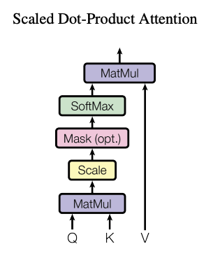

论文中提到，优化3D高斯的参数来获得隐式表达，这些参数包括:位置、协方差、透明度$\alpha$、球面谐波系数（SH coefficients）以及高斯密度的自适应控制

**球谐函数来表达颜色，可以表达依赖于视角的颜色(view dependent color)。** [reference](https://github.com/graphdeco-inria/gaussian-splatting/issues/458)

# 球谐函数

球谐（Spherical Harmonics）函数是一组基函数，通常用于表示球面上的函数。在计算机图形学中，球谐函数被广泛应用于光照和反射模型中，用来表示光照或反射的强度分布。

## 基函数

基函数其实是一个相对的概念，类似于空间中的基向量，基向量可以通过组合表示张成的空间中的所有向量。同理，基函数也可以通过线性or非线性组合来表示其张成的函数空间的函数。

> **投射、正交、叉乘、点乘**

以[该文](https://zhuanlan.zhihu.com/p/649881002)为例，很多中文的内容上会使用"投射"这种描述，其实对应着英文中的project, 用"线性组合"或许是更合适的。

基函数是一些可以通过调整比例然后互相组合来形成原函数近似的简单函数。这个组合的过程叫做投射。通过将原函数投射到不同的基函数上得到每个基函数对应的系数，

Q:什么是"投射"？什么是函数叉乘？为什么叉乘能够得到基函数对应的系数$c_i$

## bg:线性基函数与非线性基函数

### 线性基函数
基函数的形式本涉及到基函数之间的乘积或其他非线性操作。常见的线性基函数就是多项式基函数。

一次多项式基函数：$f(x) = ax + b$

二次多项式基函数：$f(x) = ax^2 + bx + c$

线性基函数并非是只有一个基函数，其可以包含多个基函数，但是每个基函数都是关于输入变量($x$)的线性函数。例如线性基函数$f(x) = ax + b$就是由基函数$y=x$和$y=1$通过常数系数$a$和$b$组合成的。$y=x$是关于$x$的线性函数，$y=1$是常数函数，都是线性的。因此其线性组合成的

### 非线性基函数

非线性基函数，基函数自身是非线性的或者基函数之间进行了非线性操作。

高斯基函数：$f(x) = e^{-\frac{(x - \mu)^2}{2\sigma^2}}$
  

sigmoid 基函数：$f(x) = \frac{1}{1 + e^{-x}}$

多项式基函数：$f(x) = x^2, x^3, x^4, ...$

# 

总之，球谐函数的结构由其次数 l 和阶 m 决定，其中 l 表征对极角的函数依赖性，m 表征对方位角的依赖性。前三个系数也称为高斯系数，在特定l度内对结构的变化起作用。操纵 l 和 m 可以影响谐波的结构，使用 Hummingbird Exceed/Open Exceed 等程序可以显示这些变化。除了更常用的指数基之外，高斯系数还经常用作球谐函数的基。

Reference: https://www.physicsforums.com/threads/spherical-harmonics-degree-l-order-m-structure-variation.805217/

# 论文中关于颜色的消融实验

根据github的[issue](https://github.com/graphdeco-inria/gaussian-splatting/issues/73)

> the 0th band is a constant color for all directions. Effectively we set the band to 0 for the ablation, so we just optimized an RGB color value.

以及另一个[issue](https://github.com/graphdeco-inria/gaussian-splatting/issues/485)

> Parameters f_dc_0, f_dc_1, f_dc_2 contain your R, G and B colors, You need to convert them into regular format with something like R = 0.5 + C0 * f_dc_0 where C0 is the zeroth-order spherical harmonic coefficient. After that, you will obtain colors in the [0, 1] range and it is straightforward to map them to [0, 255] integers.

# code

  

3d gaussian splatting论文中提到其关于谐波函数的实现遵循前两篇论文

[**Plenoxels: Radiance Fields without Neural Networks**](https://alexyu.net/plenoxels/)

[**Instant Neural Graphics Primitives with a Multiresolution Hash Encoding**](https://nvlabs.github.io/instant-ngp/)

> The directional appearance component (color) of the radiance field is represented via spherical harmonics (SH), following standard practice [Fridovich-Keil and Yu et al. 2022; Müller et al. 2022].

# 参考

[关于球谐函数的通俗解释](https://zhuanlan.zhihu.com/p/351289217)