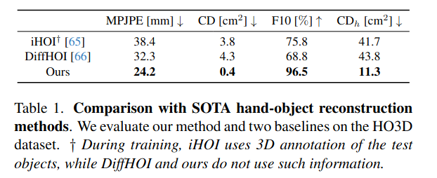
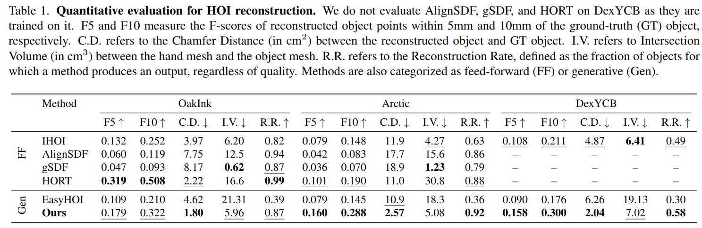
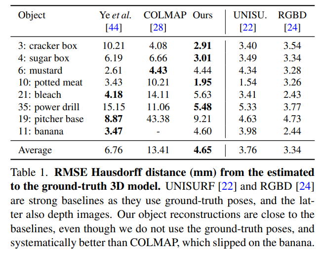
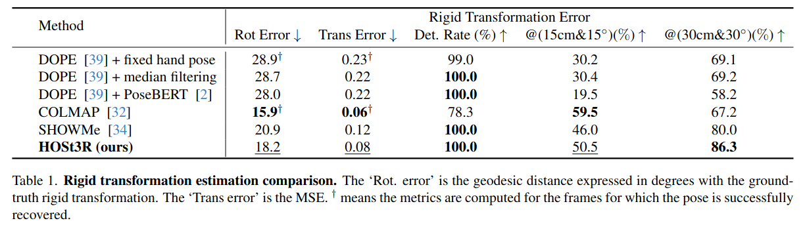
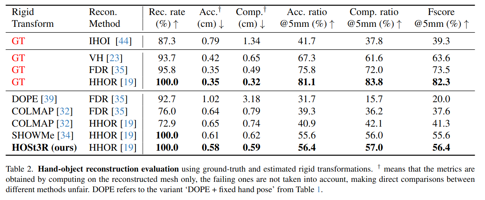
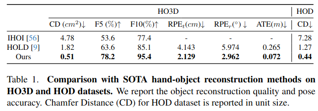
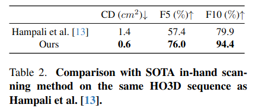
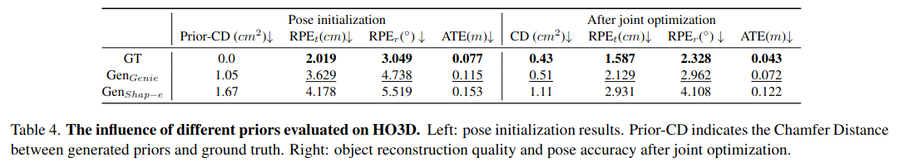
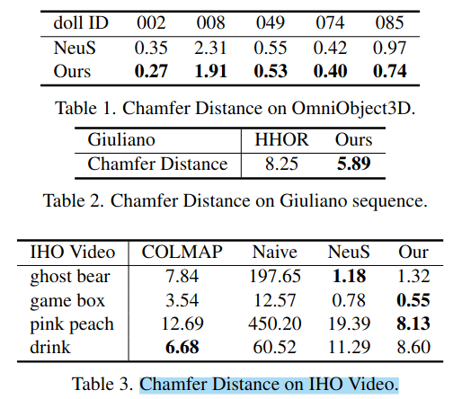

## Related Work

### 分类

| Branch | Name | From | Input | Output |
|--------|------|------|-------|--------|
| Hand-object 3D recon, object-agnostic | HOSt3R | arXiv 2025 | two RGB image| mask, **pointcloud (hand & obj)**|
| Hand-held Objects Reconstruction | HORT | arXiv 2025 | single RGB image| mask, **pointcloud(obj), mesh(hand)**|
| Hand-object 3D recon, category-agnostic | HOLD | CVPR 2024 | RGB images | mesh |

#### HOSt3R

现有的**RGB序列**重建主要是两阶段pipeline: 

1.hand-object 3D tracking
2.multi-view 3D reconstruction

现有的方法依赖关键点检测技术, SfM和hand-keypoint optimization. 对于不同模型形状、弱纹理和hand-object互遮挡情况难以处理

#### HORT

使用coarse-to-fine策略, 从图像中生成稀疏点云并refine为pixel-aligned image feature. 使用图像特征和3D手几何特征预测物体的点云和相对于手的pose. 

#### HOLD

## 可能会用到相关代码

Zhe Cao, Ilija Radosavovic, Angjoo Kanazawa, and Jitendra Malik. Reconstructing hand-object interactions in the wild. In Proceedings of the IEEE/CVF International Conference on Computer Vision, pages 12417–12426, 2021. 2, 4
Yana Hasson, G ̈ul Varol, Cordelia Schmid, and Ivan Laptev. Towards unconstrained joint hand-object reconstruction from rgb videos. In 2021 International Conference on 3D Vision (3DV), pages 659–668. IEEE, 2021. 4

Hand-held Object Reconstruction from RGB Video with Dynamic Interaction中提到这两个里面有代码，渲染物体为mask。
> 3.2: Previous works [5, 15] render 2D mask Mrender from the 3D mesh and compare it with the input object mask M for optimization:

汇总近几年的相关工作. 

## 重新梳理

如果按prior/template来进行分类, 多数工作假设能够获得交互物体的预扫描模板。这就导致难以泛化（因为实际场景中对每一个物体都扫描是困难的）

而无需先验的方法如果训练数据较少，泛化性能依然不够。[Ye et al.](#diffusion-guided) 在6个物体类别的数据集上进行了训练，并使用该训练的先验来重建hand&object，受到训练数据的限制。

还有一组方法使用单目视频来进行in-hand object scanning, 使用多视角重建技术来整合不同视角下的观察结果。[CVPR23](#in-hand-scanning)， [SIGGRAPH](#Zhou2022)(相机固定不动)，[Color-NeuS](#Color-NeuS). HOLD中提到这些方法不考虑手的关节（因为在输入的单目视频中手并非刚体，无法参与多视角重建环节）

## 论文

### 单目扫描(monocular video scanning)

#### (CVPR 2023) In-hand 3d object scanning from an rgb sequence.{#in-hand-scanning}

#### (SIGGRAPH Asia 2022) Reconstructing hand-held objects from monocular video.{#Zhou2022}

#### (3DV 2024) Color-NeuS: Reconstructing neural implicit surfaces with color. {#Color-Neus}

### template-based recon

#### Diffusion-guided reconstruction of everyday handobject interaction clips.{#diffusion-guided}

### (CVPR 2024) HOLD: Category-agnostic 3D Reconstruction of Interacting Hands and Objects from Video[[page](https://zc-alexfan.github.io/hold)]

> _Zicong Fan1,2 Maria Parelli1 Maria Eleni Kadoglou1 Muhammed Kocabas1,2 Xu Chen1,2,† Michael J. Black2 Otmar Hilliges1_ 
> _1ETH Z ̈ urich, Switzerland 2Max Planck Institute for Intelligent Systems, T ̈ ubingen, Germany_

手持物体重建仅是其实验的一部分，

#### metrics

测试的指标包括: 手部姿态准确度(**MPJPE**, root-relative mean-per-joint error), 物体姿态和形状的准确度(**CD**, Chamfer Distance), F-score(**F10**, 10mm阈值以下被认为正确)和物体的手相对倒角距离($\textbf{CD}_{h}$, hand-relative Chamfer distance for the object)

#### 数据集

HO3D(对比方法iHOI在训练过程中使用了测试物体的3D标注)

#### 对比方法

iHOI, DiffHOI

### (3DV 2024) Color-NeuS: Reconstructing Neural Implicit Surfaces with Color[[page](https://zlicheng.com/color_neus/)]

> _Licheng Zhong1 ⋆ Lixin Yang1,2 ⋆ Kailin Li1 Haoyu Zhen1 Mei Han3 Cewu Lu1,2 †_ 
> _1Shanghai Jiao Tong University 2Shanghai Qi Zhi Institute 3National University of Singapore_

#### 测试指标

#### 数据集

### (CVPR 2023) In-Hand 3D Object Scanning from an RGB Sequence[[page](https://rgbinhandscanning.github.io/)]

> _Shreyas Hampali1,3, Tomas Hodan1, Luan Tran1, Lingni Ma1, Cem Keskin1, Vincent Lepetit2,3_  
> _1Reality Labs at Meta, 2LIGM, Ecole des Ponts, Univ Gustave Eiffel, CNRS, Marne-la-Vallee, France, 3Institute for Computer Graphics and Vision, Graz University of Technology, Graz, Austria_

将连续的RGB序列拆分成不同的片段, 并确保片段之间有重合。

YCB, Aria

对于香蕉、剪刀这种“薄”+“弱纹理”特点的物体，重建容易失败。

### (ICCV 2023) CHORD: Category-level Hand-held Object Reconstruction via Shape Deformation [[page](https://kailinli.github.io/CHORD/)]

> _Kailin Li, Zhewei Huang, Chen Wang, Zhiyuan Wang, Juyong Zhang_ 
> _University of Science and Technology of China, Shanghai AI Lab_

CHORD 方法提出了一种基于类别形状先验的变形重建方法。

#### Metrics

测试的指标包括: 形状重建精度 (**Chamfer Distance, CD**), 形状完整性 (**F-score**)。

#### 数据集

COMIC (本文新构建的数据集) 和 HO3D。

#### 对比方法

iHOI, ObMan, NDF, DDF-HO

### (SIGGRAPH Asia 2022) Reconstructing Hand-Held Objects from Monocular Video[[page](https://dihuangdh.github.io/hhor/)]

1. RGB video作为输入
2. **相机固定不动**, 需要借助背景图像来分割手和物体，再使用hand segmentation进一步将手分割出来。

#### 测试指标

Chamfer Distance

#### 数据集

自建数据集HOD, 35个物体

#### 对比方法

ObMan, GF, IHOI

### (CVPR 2022) What's in your hands? 3D Reconstruction of Generic Objects in Hands.[[page](https://judyye.github.io/ihoi/)]

> _Wentian Qu1,2 Zhaopeng Cui3 Yinda Zhang4 Chenyu Meng1,2 Cuixia Ma1,2
Xiaoming Deng1,2* Hongan Wang1,2∗_ 
> _1Institute of Software, Chinese Academy of Sciences 2University of Chinese Academy of Sciences 3State Key Lab of CAD&CG, Zhejiang University 4Google_

### (ICCV 2023) Novel-view Synthesis and Pose Estimation for Hand-Object Interaction from Sparse Views

稀疏视角重建

### (2021 3DV)Towards Unconstrained Joint Hand-Object Reconstruction From RGB Videos [[page](https://hassony2.github.io/homan.html)]

### () 
### () 
### () 
### () 

---

---

### (CVPR 2022) What’s in Your Hands? 3D Reconstruction of Generic Objects in Hands [[page](https://github.com/yufeiy2/whats-in-your-hands)]

> _Yufei Ye, Shubham Tulsiani, Abhinav Gupta_ 
> _Carnegie Mellon University_

该方法利用手部姿态作为条件约束，从单帧 RGB 图像中重建物体。

#### Metrics

测试的指标包括: 形状重建精度 (**Chamfer Distance, CD**) 和 F-score。

#### 数据集

HO3D, DexYCB

#### 对比方法

ObMan, iHOI, SDF-based methods

---

### (ICCV 2023) HO-NeRF: Novel-view Synthesis and Pose Estimation for Hand-Object Interaction from Sparse Views [[page](https://github.com/wentianqu/HO-NeRF)]

> _Wentian Qu, Jiarui Xu, Animesh Garg_ 
> _University of Toronto_

HO-NeRF 使用 NeRF 进行新视角合成，并优化手部和物体的位姿。

#### Metrics

测试的指标包括: 视角合成质量 (PSNR, SSIM, LPIPS)，姿态估计误差 (MPJPE, CD)。

#### 数据集

DexYCB, ObMan

#### 对比方法

iHOI, DiffHOI, NeRF-baselines

---

### (CVPR 2022) Collaborative Learning for Hand and Object Reconstruction with Attention-Guided Graph Convolution [[page](https://github.com/tsehoeldentse/hand-object-reconstruction)]

> _Tze Ho Elden Tse, Zhimin Chen, Antonio Garcia-Uceda, Gregory Rogez, Edmond Boyer, Helge Rhodin_ 
> _INRIA, University of British Columbia_

该方法利用注意力引导的图神经网络进行手部和物体的联合重建。

#### Metrics

测试的指标包括: 形状重建精度 (Chamfer Distance, CD)，F-score，手部姿态误差 (MPJPE)。

#### 数据集

HO3D, DexYCB

#### 对比方法

ObMan, iHOI, Graph-based methods

---

## 其他的/或许相关工作

### (WACV 2025) DN-Splatter: Depth and Normal Priors for Gaussian Splatting and Meshing [[page](https://maturk.github.io/dn-splatter/)]

引入深度和法向先验来得到更好的3dgs与meshing

### (CVPR 2025) https://github.com/facebookresearch/fast3r [[page](https://github.com/facebookresearch/fast3r)]

添加了全局fusion来加速原本的匹配过程。

### (arXiv 2024) [Spann3R] 3D Reconstruction with Spatial Memory [[page](https://hengyiwang.github.io/projects/spanner)]

一些想法

~~~
利用hand pose做点什么？可以视为已知条件。遮挡部位已知，可以推测遮挡部位后面的区域
离线
~~~

可以借助flow的思想，模型的输入是点云/KDTree+当前帧的观测（RGB图像）

点云的一个问题是变长。KDTree能够在一个归一化空间下表示周围相机的视角。对于动态物体+动态相机是否有帮助？

手持物体的运动是连续的，帧和帧之间有连续的关系，因此使用全双向注意力机制full bidirectional attention mask

甚至对于ego-centric条件应该更有利。

---

使用扩散/flow的思路来直接预测hand pose遮挡部位后面的形状？

有一个潜在的问题是，action本身只有关节的位置，但是真实世界中的位姿$[R|t]$中旋转其实是要满足约束的。（能否使用球坐标+Octree来解决？）

must3r的causal mask attention让其仅能关注之前的图像，为什么？

---

之前改3R失败的原因在于：memory中的camera pose不准确，仅依赖3R的匹配能力，不引入额外的先验/信息无法准确定位。

1. 生成模型形状的先验 / 高斯噪声球
2. 手姿态估计，生成遮挡mask
3. 物体mask
4. 仅依赖这些不够，将1中的高斯球与flow结合。使用视角的观测mask，作为重投影，约束网络学习，根据mask来改变形状。或者估计相机的姿态。

RGB + 点云1 -> 点云2 （这是3D生成的思路）
RGB + info + joint + task -> action 

action with noise + RGB -> action with less noise

输入：观测（RGB）+ cam pose(uv) -> cam pose(uv) less error

flow学习cam pose的姿态下降方向。将cam pose修改为: 

1. 物体/手在中心
2. 球坐标
3. scale 缩放画面/物体/手以统一大小
4. 在球面上移动点，flow学习移动的方向
5. 3R/匹配的结果仅提供初值
6. 当球面的视角足够后开始重建 

---

~~~
手-物体重建 (Hand-Object Reconstruction)

Diffusion-Guided HOI Reconstruction (Ye et al., ICCV 2023): This work reconstructs both a hand and an unknown object from a video clip using a per-sequence optimization that combines multi-view cues with a learned diffusion prior
openaccess.thecvf.com
. The core idea is to represent the object with a neural 3D implicit model and refine it via score distillation sampling: they train a latent diffusion model on images of objects in hand, conditioned on hand pose and object category, and use it as a prior to guide differentiable rendering of the 3D scene
openaccess.thecvf.com
. During optimization, the video provides sparse multi-view geometry while the diffusion prior fills in occluded geometry, enforcing plausible shapes even when the hand covers parts of the object. This approach yields significantly improved 3D reconstructions under heavy occlusion
openaccess.thecvf.com
. Relation to user’s idea: It uses a data-driven prior (diffusion) and differentiable rendering similar to the user’s concept, although it guides shape with a learned model rather than an explicit Gaussian shape prior, and it does not explicitly use optical flow for pose (it optimizes shape and pose via gradient descent with the diffusion prior as guidance).

FollowMyHold (Aytekin et al., arXiv 2025): This recent framework introduces a diffusion-based method for single-image hand-held object reconstruction using the hand as geometric context
arxiv.org
. It conditions a latent diffusion model on the inpainted object appearance and then performs staged inference-time optimization: first optimizing the hand pose, then the object, then both together
arxiv.org
arxiv.org
. The diffusion model is guided by multi-modal geometric cues (surface normals, depth alignment, silhouette consistency, 2D keypoints) and enforced with Signed Distance Field (SDF) supervision plus contact/non-intersection losses
arxiv.org
. The method directly generates high-quality object geometry during the diffusion denoising process by injecting these geometric constraints “in the loop.” The result is a physically plausible hand-object mesh that remains robust under occlusion
arxiv.org
. Relation to user’s idea: It leverages differentiable rendering and a strong prior (diffusion) for shape, akin to using a Gaussian-like prior. However, the focus is on single-view reconstruction guided by diffusion (not explicitly on camera pose updates via flow), so it’s only partially aligned with the idea of using a Gaussian shape prior and flow for pose optimization.

gSDF – Geometry-Driven SDF for HO (Chen et al., CVPR 2023): This work uses an implicit SDF representation for joint hand-object shape, augmented with strong geometric priors from a hand model
openaccess.thecvf.com
. The key idea is to exploit the hand’s known kinematic structure: they first predict the hand joint angles (MANO model) and a rough object pose from the RGB image
openaccess.thecvf.com
. These estimates provide a pose prior that guides the SDF network – for each 3D query point, they input not only image features but also hand-object kinematic features (e.g. distance to hand bones, object frame) to inform whether the point lies on hand, object, or free space
openaccess.thecvf.com
. By aligning the implicit field with the articulated hand pose (a “kinematic chain” of transformations), the method injects a Gaussian-like prior of plausible hand shape and significantly reduces ambiguities
openaccess.thecvf.com
openaccess.thecvf.com
. They also leverage temporal information (if a video is available) to improve robustness under occlusion and motion blur
openaccess.thecvf.com
. This results in more accurate meshes for both hand and object than prior methods lacking such priors
openaccess.thecvf.com
. Relation to user’s idea: gSDF uses a strong shape prior (the parametric hand model) to constrain reconstruction, similar in spirit to using a Gaussian shape prior. It does use differentiable inference (the SDF is learned end-to-end and can be optimized), but it does not employ flow-based pose updates – the hand pose is obtained from a regression network rather than iteratively refined via optical flow. Nonetheless, it demonstrates the benefit of combining an explicit shape prior with a learnable reconstruction module, which is conceptually related to the user’s proposal.

通用物体重建 (General Object Reconstruction)

GaussianObject (Yang et al., arXiv 2024): GaussianObject addresses high-fidelity object reconstruction from extremely sparse views (only 4 images) using a combination of explicit Gaussian primitives and generative priors
arxiv.org
. The pipeline has two stages: (1) Structure-prior initialization: it computes a visual hull from the 4 images to roughly constrain the object’s volume and places a set of 3D Gaussian ellipsoids inside this hull
arxiv.org
arxiv.org
. It also removes outlier “floater” Gaussians that don’t conform to any view, which injects a coarse geometric prior of the object’s shape
arxiv.org
. (2) Diffusion-based refinement: a Gaussian Repair network (built on 2D diffusion models) is then used to hallucinate missing details and correct errors in the Gaussian representation
arxiv.org
. Essentially, they render the current Gaussian splatting result and use a diffusion model (similar to Stable Diffusion with ControlNet) to imagine how the object should look, then update the Gaussians accordingly. This differentiable refinement supplements omitted geometry/texture from the sparse input, yielding a much more complete and accurate 3D model
arxiv.org
arxiv.org
. GaussianObject achieves state-of-the-art reconstruction quality on challenging datasets with only four views, outperforming NeRF-based sparse-view methods
arxiv.org
. Relation to user’s idea: This method explicitly uses Gaussian “sphere” primitives as the 3D shape representation and employs a generative model to guide the optimization – closely mirroring “Gaussian prior + learnable optimizer.” However, since the input images’ poses are assumed known, it doesn’t focus on updating camera pose via optical flow. Its contribution lies more in shape reconstruction with Gaussian priors; still, its two-stage strategy (coarse prior + diffusion refinement) could inspire using a Gaussian shape prior and iterative optimization in the user’s scenario.

GSD: View-Guided Gaussian Splatting Diffusion (Mu et al., ECCV 2024): GSD introduces a diffusion-based generator for single-view 3D object reconstruction that operates directly in the space of Gaussian splatting primitives
ecva.net
ecva.net
. The method first trains an unconditional 3D diffusion model that learns to generate plausible objects as sets of 3D Gaussians (ellipsoids), effectively building a powerful 3D shape prior
ecva.net
. At test time, given one input image of an object, they perform view-guided denoising: starting from random Gaussians, they iteratively refine the Gaussian set so that its renderings match the input view
ecva.net
. The differentiable Gaussian splatting renderer allows them to propagate fine-grained 2D image features (from the input) into the diffusion process as guidance
ecva.net
. They also employ a 2D diffusion model in a post-processing step to polish the rendered views, further enhancing texture details by translating the renderings toward more realistic images before re-fitting the Gaussians
ecva.net
. The outcome is an explicit 3D model (Gaussians) with high-quality geometry and appearance, achievable without any test-time training of networks (only the latent diffusion sampling). Relation to user’s idea: GSD uses a Gaussian-based shape representation and differentiable rendering extensively, driven by a generative prior – very much in line with using a Gaussian prior. It doesn’t involve camera pose optimization (the single input view is fixed), but it showcases how a flow-based generative model (diffusion, which starts from Gaussian noise) can direct the creation of a 3D model. This could inspire the use of normalizing flows or diffusion as a learnable optimizer for shape, while the user’s idea additionally suggests using optical flow for pose – which GSD does not cover since pose is given.

可微姿态估计 (Differentiable Camera Pose Estimation)

GS-CPR: Camera Pose Refinement via 3D Gaussian Splatting (Liu et al., ICLR 2025): GS-CPR is a test-time framework for refining camera pose estimates by leveraging a pre-built 3D Gaussian Splatting scene model
arxiv.org
. The setting assumes we have an initial coarse pose (e.g. from a pose regressor or SfM) and a 3D representation of the scene as a set of Gaussians (obtained beforehand, e.g. via training on multi-view data). GS-CPR then renders a synthetic view from the Gaussian scene and establishes dense 2D–3D correspondences between the rendered image and the actual query image using a pre-trained matching network (MASt3R)
arxiv.org
. These correspondences allow a one-shot pose update (essentially a PnP + RANSAC or optimization step) to align the camera more accurately
arxiv.org
. Thanks to the highly efficient differentiable rendering of 3D Gaussians, this approach can refine pose without training any new networks or iterating many times. GS-CPR achieves state-of-the-art localization accuracy on indoor and outdoor benchmarks, beating NeRF-based pose optimization baselines in both accuracy and speed
arxiv.org
. Relation to user’s idea: This method uses Gaussian spheres (3DGS) as the scene prior and a form of learnable optimizer (the matching network provides cues for optimization) to refine poses. It aligns with the idea of combining Gaussian-based representation with an optimization procedure for pose, although GS-CPR’s optimizer is a classical geometry step guided by learned correspondences (not optical flow). It demonstrates the benefit of differentiable rendering with Gaussians for pose refinement.

Cameras as Rays: Ray Diffusion for Pose (Zhang et al., 2024): This work takes a novel approach by reparameterizing the camera pose as a bundle of rays and applying a denoising diffusion model to estimate pose from sparse views
arxiv.org
arxiv.org
. Instead of predicting rotation angles and translation directly, they represent each camera by a set of sampled rays (in Plücker coordinate form) through image patches. A transformer-based model first regresses these rays from the input image features, effectively predicting where each patch’s ray goes in 3D
arxiv.org
. Then, to account for ambiguity in sparse-view settings, they train a diffusion model on the space of ray sets, which can sample plausible camera poses by denoising random ray configurations into consistent ones
arxiv.org
. This diffusion-based pose estimator produces a distribution over camera poses and achieves state-of-the-art accuracy on the CO3D dataset for sparse-view camera pose estimation
arxiv.org
. The method tightly couples image features with pose (thanks to the ray representation) and can output multiple hypotheses if needed (due to its probabilistic nature). Relation to user’s idea: Here the “prior” is a diffusion model (Gaussian noise prior) operating on camera parameters, and the optimization is learned rather than hand-crafted. While it doesn’t involve a 3D Gaussian shape prior or optical flow, it exemplifies a flow-based (diffusive) optimizer for camera pose. It could inspire using normalizing flows or diffusion to refine pose in tandem with a shape model – complementary to the user’s focus on combining shape priors with pose updates.

SparsePose: Sparse-View Pose Regression & Refinement (Sinha et al., CVPR 2023): SparsePose is a learning-based pose optimization method that directly addresses wide-baseline, few-view scenarios
openaccess.thecvf.com
. It is trained on a large object-centric dataset (CO3D) to first predict an initial pose for each image in a sparse set, and then to iteratively refine the poses through an update network
openaccess.thecvf.com
. The refinement is done by a dedicated network module that takes the current estimated poses and image features and outputs pose corrections, effectively acting as a learnable optimizer that runs for a fixed number of iterations. By training this pipeline end-to-end on many objects, SparsePose learns to enforce multi-view consistency even when traditional feature matching fails (due to too few views or lack of texture)
openaccess.thecvf.com
openaccess.thecvf.com
. It outperforms both classical SfM and previous learned methods in recovering accurate rotations and translations from as few as 5–9 images, enabling high-fidelity 3D reconstruction from very limited inputs
openaccess.thecvf.com
. Relation to user’s idea: SparsePose shows the power of an iterative learnable pose updater, akin to a neural optimizer, which aligns with the notion of using a trainable process for pose adjustment. It does not use an explicit Gaussian shape prior or differentiable rendering (it operates on learned features rather than photometric error), but it could be combined with a shape reconstruction module. In a broad sense, it reinforces the idea that neural networks can learn to perform pose refinement – a strategy that could complement the user’s Gaussian prior by providing the “flow-based” pose updates (learned from data rather than optical flow equations).

Dynamic Object Reconstruction & Tracking with 3D Gaussians (Barad et al., 2024): This work focuses on incrementally reconstructing a moving object and tracking the camera pose at the same time, using an explicit 3D Gaussian representation and photometric error minimization
arxiv.org
arxiv.org
. The approach is essentially a differentiable SLAM: as the camera views an unknown object, it continuously adds and adjusts a set of Gaussian ellipsoids to model the object’s surface, while simultaneously refining the camera’s pose. A differentiable renderer for the Gaussian splats generates predicted images, and the differences from the observed images (photometric loss) are back-propagated to update both the Gaussian parameters (positions, sizes, colors) and the camera pose
arxiv.org
arxiv.org
. This gradient-based online optimizer naturally integrates pose refinement (if the rendered image is misaligned, the error’s gradient will adjust the camera extrinsics) with shape refinement. The method requires no prior models – it starts from the first frame’s depth map to initialize Gaussians and then optimizes with each new frame – and it demonstrates successful tracking of rigid and even deformable objects in motion
arxiv.org
arxiv.org
. Relation to user’s idea: This is perhaps the closest to the user’s proposal: it uses Gaussian sphere primitives as the object shape representation and a differentiable rendering pipeline to update camera pose, effectively using image alignment errors (akin to optical flow or residual flow) to drive pose optimization. The user’s idea of using a Gaussian shape prior plus a flow-based optimizer is directly reflected here – the Gaussian model provides a prior/form for the object, and the flow of pixel intensity differences guides the pose updates. This work validates that such a combination can indeed recover both shape and pose, and could serve as a strong inspiration or baseline for the user’s approach.
arxiv.org
arxiv.org

参考文献： The descriptions above cite key details from recent publications (2022–2025) in top venues like CVPR, ICCV, ECCV, NeurIPS, ICLR, etc. Each illustrates how Gaussian-based shape priors, differentiable rendering, and learnable or flow-based optimizers are being applied in cutting-edge research, and how they relate to the user’s envisioned method. The last method in particular (Barad et al. 2024) shows a close parallel to “Gaussian shape prior + flow for pose” in practice. All these works highlight the trend of combining strong priors (geometric or learned) with differentiable optimization to tackle the ambiguities in 3D reconstruction problems
openaccess.thecvf.com
arxiv.org
.
~~~

--- 

benchmark, dataset.

metric

|paper|year|dataset|metric|result|
|--|--|--|--|--|
|HOLD|2024|HO3D|$\text{MPJPE}, \text{CD}, \text{F10}, \text{CD}_h$||
|FollowMyHand|2025|OakInk, Arctic, DexYCB|F5/10, CD,I.V, R.R||
|In-Hand 3D Object Scanning from an RGB Sequence|2023|HO3D|RMSE HD||
|HOSt3R|2025|SHOWME|RMSE HD||
|Hand-held Object Reconstruction from RGB Video with Dynamic Interaction|2025|HO3D, HOPE, HOD|$\text{CD}, \text{F5/10}, \text{CD}, \text{RPE}, \text{ATE}$||
|Color-Neus|2023|OmniObject3D, Giuliano, IHO-Video|$\text{CD}$||

---

最简单暴力的方法，直接给must3r添加一个head,输出重建的结果来训练