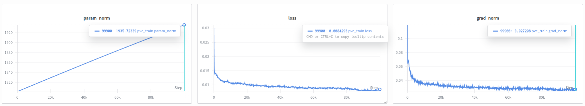

https://www.physicalintelligence.company/blog/pi0

## Before start

梳理了一下VLA的发展历程，理论上应当从RT-1, RT-2, RT-X系列开始阅读，但是考虑到24和25年相关新工作的大量出现，尽快入门更加重要。目前的阅读思路是pi0, OpenVLA, RDT, pi0.5

About **Generalist Robot Policies**(i.e., robot foundation model): 

>
> *Today’s robots are narrow specialists. Industrial robots are programmed for repetitive motions in choreographed settings, repeatedly making the same weld in the same spot on an assembly line or dropping the same item into the same box.*
> 

## pi0

> Perhaps the most tangible progress toward this kind of versatility in AI can be seen in large language- and visionlanguage models [1, 48]: systems that are pre-trained on large and very diverse corpora of images and text from the web, and then fine-tuned (“aligned”) using more carefully curated datasets meant to induce the desired pattern of behavior and responsiveness.

fine-tune 或者 align 都是指在更小的的专门数据集上进行优化。

相比于直接在专门任务的数据上进行训练，先在大规模通用数据上进行预训练，然后针对特定任务进行fine-tune或prompt会更有效。（来自NLP和CV领域大模型的经验）这样能解决鲁棒性和泛化性的问题。

Chanlenges:

1. a very large scale. 必须在大规模数据上进行训练
2. developing the right model architectures. 需要开发正确的模型架构，可以有效地利用不同的数据源
3. right training *recipe*. 训练策略，NLP和CV领域中的大模型都很依赖delicate strategies for curating pre-training and post-training data.

<figure class="figure-center">
  
  <figcaption>framework of $\pi_0$ 0</figcaption>
</figure>

$\pi_0$分别处理了这3个问题:

### Diverse data sources

为了整合不同的数据源，利用预训练的视觉语言模型（Vision-Language-Model）来导入Internet-scale的经验。也就是说: $\pi_0$模型建立在VLM的基础上，继承LM和VLM的一般知识、语义推理和解决问题的能力。然后进一步训练模型，使其包含机器人动作**action**，转化为VLA model.

*cross-embodiment training* 来整合不同的机器人数据源。因为不同的机器人类型可能有不同的配置和动作表示。（single, dual-arm system, mobile manipulators）

> in order to make it possible to perform highly dexterous and intricate physical tasks, we use an action chunking architecture with flow matching (a variant of diffusion) to represent complex continuous action distributions

*action chunking architecture with flow matching*来表示复杂连续的动作分布(complex continuous action distribution)，能够实现灵活和复杂的物理任务。模型能够在50Hz的速度控制机器人来完成叠衣服等工作。 为了将flow matching与VLM结合，使用了一个novel *action expert* 使用flow-based outputs来增强standard VLM

(初步猜测, action expert是负责将VLM的输出解释为特定格式或类型的描述？能够与action对应？或者描述action？)

**training recipe** pre-training/post-traininig separation. 与NLP和CV中的大模型一样，先在large and diverse corpus上进行预训练，然后在more narrow and more carefully curated data上进行fine-tune来获得期望的行为模式（灵活性、效率和鲁棒性）。模型不仅能只在高质量的数据集上训练，这样无法教会模型如何从错误中恢复，也不能只在低质量数据集上训练，这样模型无法学会如何高效稳健地完成任务。需要将二者结合，尽可能尝试类似于高质量数据的行为，但仍然有一系列的回复和纠错措施，能够处理错误情况。

contribution包含两条: 、

1. 基于VLM预训练和flow matching的通用机器人策略架构
2. 机器人基础模型的pre-training/post training训练策略的实证研究(empirical investigation)

评估维度分三类：

1. 零样本语言指令执行(out of the box with language commands)
2. 针对特定任务的微调(fine-tuning to downstreams tasks)
3. 配合high-level semantic policy输出intermediate language commands来执行complex and temporally extended tasks(将high-level命令拆分成 中间语言命令，来执行复杂任务)

## autoregressive discretization

自回归离散化，将连续的机器人动作（关节角、末端速度、抓取开合值等）量化成离散的"action token"，再像语言模型那样按时间顺序一步步预测下一个action token(自回归)

**以类似text token的方式表示action**

## flow matching

a variant of diffusion.

优势: 能够处理高频action chunks(up to 50Hz)和高灵巧任务

## Dataset

使用了10000小时的数据集和另一个开源OXE数据集。

## Framework

pi0依然使用VLM这一套，但是使用了机器人专用的数据来训练（机器人内部数据，关节等。以及action），高精度和多模态建模能力来自于flow matching，能处理复杂和灵巧操作。

π₀ 的设计理念源自 Transfusion 框架。
Transfusion 的思想是**不再为不同类型的任务分别设计独立模型（比如一个做分类、一个做回归），而是用一个 Transformer 同时处理多种输出类型：离散的（如文字、类别） 和 连续的（如坐标、动作）。**

在这个统一 Transformer 中：

如果 token 代表离散任务（比如语言词元、分类标签），就用 交叉熵损失（标准的分类任务损失）。
如果 token 代表连续任务（如动作、位置、姿态），就用 Flow Matching Loss（连续分布拟合损失）。

这样，整个 Transformer 同时学习了多模态多目标的联合分布，可以自然地在视觉、语言、动作等多种模态之间共享语义和结构。

---

第一部分：pre-training mixture 包含:
 
1. 灵巧操作数据集 $\pi$ dataset（7中不同的机器人配置 + 68种不同任务）
2. OXE dataset（22个机器人的数据）
3. language labels，包含任务名称和分段注释（子轨迹的fine-grained标签，通常2s）

预训练阶段的目的是训练一个具有广泛的能力和通用性base model。但不一定专门对于某一项任务具有high performance.

这个base model能够follow language commands并执行多样的任务(at rudimentary proficiency)

对于复杂且灵巧的任务，采用post-training procedure. 使用high-quality curated data使模型适应特定下游任务。

$\pi_0$模型在PaliGemma VLM的基础上训练，使用data mixture对其进行进一步训练。 添加了flow matching来获得action outputs.

$\pi_0$的输入是$[I, \mathit{l}_t， q_t]$

$\mathit{l}_t$是language tokens

**state**: $q_t$是joint angles（机械臂内部数据）

图像$I_t$和$q_t$都使用对应的encoder来编码+线性投影来映射到与language token相同的embedding空间中。
 
对于输出，每一个action $a_t$都有一个对应的**action token**，其输入到action expert中。在训练阶段，使用conditional flow matching loss来监督action token来

## flow matching loss

flow matching是一种扩散模型变体，过程类似于DDPM的去噪，但是是通过一个**连续时间的向量场**来实现的（而非DDPM中离散时间的噪声逐步去除）

$$
L_{\tau}(\theta) = \mathbb{E}_{p(A_t | o_t),q(A_t^\tau|A_t)} \left[ \| v_{\theta}(A_t^\tau, o_t) - u(A_t^\tau | A_t) \|^2 \right]
$$

### 符号解释

$o_t$ 机器人的$t$时刻观测（2~3张图像，语言命令，机械臂内部状态）

$A_t$: 当前观测对应的未来一段的真实动作（从专家演示中得到）。即gt标签，代表$t$时刻之后的ground truth动作

$\tau$: 随机取的加噪程度

$A_t^\tau$: 基于$A_t$加噪后的action序列

$v_{\theta}(A_t^\tau, o_t)$: 表示模型预测的“去噪方向”

$u(A_t^\tau | A_t)$:  理论上的“去噪方向”，基于已知的加噪前后的$A_t$和$A_t^\tau$来计算

$\mathbb{E}_{p(A_t|o_t),\, q(A_t^{\tau}|A_t)}[\cdot]$ 是 **条件期望**，表达 Flow Matching 损失函数在训练时的采样来源与平均方式。因为$\tau$的随机性，要多次计算平均来获得期望。

$p(A_t|o_t)$是条件动作分布，代表**真实的动作分布**，这个来自于数据集中的专家演示(Demos)。

即：“在给定观测下，专家演示会怎么做”的分布。

$q(A_t^{\tau}|A_t)$ 是加噪分布(Gaussian probability path)

表示如何从 真实动作$A_t$生成一个**带噪动作**$A_t^{\tau}$

即：从真实动作出发，沿着线性高斯路径(linear Gaussian probability path)加入噪声，控制参数$\tau$就是步长，控制噪声程度。1表示无噪声，0表示完全噪声。

所谓线性高斯路径就是沿着高斯的表示加噪声。

$$
q(A_t^{\tau}|A_t) = \mathcal{N}(\tau A_t, (1-\tau)I)
$$

可以将$\mathcal{N}(\cdot)$理解成（代码的实现也是这么做的）

$$
A_t^{\tau}=\tau A_t + (1-\tau)\epsilon
$$

当$\tau=1$时，$A_t^{\tau}$退化为$A_t$

当$\tau=0$时，$A_t^{\tau}$为纯高斯噪声$\mathcal{N}{0, I}$

---

$$
L^{\tau}(\theta) = 
\mathbb{E}_{p(A_t|o_t),\, q(A_t^{\tau}|A_t)} 
\left\| 
v_{\theta}(A_t^{\tau}, o_t) - u(A_t^{\tau}|A_t)
\right\|^2
$$

解释某一次计算：根据观测$o_t$, 随机取数据集中的一个演示动作$A_t$，根据噪声模型加噪得到$A_t^{\tau}$，然后计算损失：$\left\| v_{\theta}(A_t^{\tau}, o_t) - u(A_t^{\tau}|A_t) \right\|^2$

---

**Q: 为什么模型输入有带噪动作$A_t^{\tau}$，不应该只有观测$o_t$吗？**

并非“直接回归式的控制”，输入观测输出预测。$\pi_0$及扩散/flow模型要学习的并不是单步预测函数，而是连续生成过程。学习的是：

**如果当前动作状态是带噪声的$A_t^{\tau}$，在条件$o_t$下，应该向哪个方向移动，才能逐步恢复到ground truth动作$A_t$**

因为同一个条件$o_t$可能对应多种合理动作，为了学习多模态分布，需要学习多种合理的动作输出。

如果模型只输入一个观测$o_t$，输出会成为平均动作。

引入噪声，在不同的噪声扰动下会生成不同的动作路径，模型能够表示一个完整的动作分布，而非单点平均。

在训练阶段是这样，训练完成的推理阶段也是这样。推理阶段的噪声来自一个标准的高斯噪声，随着推理的进行逐步变成目标action.

---

**Q：为什么对去噪的方向计算loss,而不是对去噪后的结果计算loss？**

这个问题是Flow Matching（向量场学习）与普通Diffusion（直接回归）的不同。

去噪回归（Denoising regression）的思路就是让网络直接根据输入的带噪动作，直接回归预测去噪后的动作$\hat{A}_t$，然后直接计算$|\hat{A}_t - A_t|^2$

Flow Matching是从常微分方程（ODE）的角度来建模生成过程的。其建模的是噪声如何从向量场逐步流向数据：

$$
\frac{dA_t}{dt}=v_{\theta}(A_t, t)
$$

那么，为什么学方向而不是结果？

如果学习方向，整个过程是一个连续的过程，可以通过数值积分一步步从噪声走回原始数据。但是如果直接预测最终去噪的结果，就没法定义这个连续的过程。

**其余的参考Flow Matching ->**

---

线性高斯和最优传输，二者之间可以互相替换？

> Recent work in high-resolution image [14] and video [38] synthesis has shown that flow matching can achieve strong empirical performance when combined with a simple linearGaussian (or optimal transport) probability path

**概率路径**

如何在数据分布和噪声分布之间定义一条概率路径(probability path)

在flow matching/diffusion中，让模型学会将一个简单分布（一般是高斯噪声分布）逐渐“flow”为一个复杂的分布（真实的数据分布）

需要定义一条在分布空间中的路径

$q(A^{\tau}|A), \quad \tau \in [0, 1]$

$q(A^{\tau} \mid A)$是一个条件概率分布，表示在$A$条件下，噪声强度为$\tau$, 带噪动作$A^{\tau}$的分布。

在$\pi_0$系列论文中，$q(A^{\tau} \mid A)$被定义为一个线性高斯分布(linear-Gaussian distribution)

$$
q(A^{\tau} \mid A) = \mathcal{N}(\tau A, (1-\tau)I)
$$

什么是线性高斯(linear Gaussian)

什么是最优传输(optimal transport)

---

Q:为什么在计算$\mu(A_t^{\tau}|A_t)$时，用的是$\mu(A_t^{\tau}|A_t)=\epsilon-A_t$

加噪过程我们已经知道是：

$$
A_t^{\tau}=\tau A_t + (1-\tau)\epsilon
$$

那么要想获得噪声的流动方向

$$
\mu(A_t^{\tau}|A_t) = \frac{dA_t^{\tau}}{d\tau}
= \frac{d(\tau A_t + (1-\tau)\epsilon)}{d\tau}
= A_t - \epsilon
$$

去噪和加噪的方向相反，对这个方向取反即能得到：$\epsilon-A_t$

---

## DROID full fineture

$\pi_0$ 初始化，pi05_full_droid_finetune

~~~
XLA_PYTHON_CLIENT_MEM_FRACTION=0.9 uv run --no-sync scripts/train.py pi05_full_droid_finetune --exp-name=pvc_train --overwrite
~~~

norm_stat 目的是为了归一化轨迹

~~~
uv run --no-sync scripts/compute_norm_stats.py --config-name pi05_full_droid_finetune --max-frames 10_000_000
XLA_PYTHON_CLIENT_MEM_FRACTION=0.9 uv run --no-sync scripts/train.py pi05_full_droid_finetune --exp-name=my_experiment --overwrite

~~~

~~~
(.venv) (base) jovyan@container-test-0:~/workspace/openpi$ uv run --no-sync scripts/compute_norm_stats.py --config-name pi05_full_droid_finetune --max-frames 10_000_000
2025-11-11 08:29:08.721498: E external/local_xla/xla/stream_executor/cuda/cuda_dnn.cc:9261] Unable to register cuDNN factory: Attempting to register factory for plugin cuDNN when one has already been registered
2025-11-11 08:29:08.721566: E external/local_xla/xla/stream_executor/cuda/cuda_fft.cc:607] Unable to register cuFFT factory: Attempting to register factory for plugin cuFFT when one has already been registered
2025-11-11 08:29:08.724167: E external/local_xla/xla/stream_executor/cuda/cuda_blas.cc:1515] Unable to register cuBLAS factory: Attempting to register factory for plugin cuBLAS when one has already been registered
2025-11-11 08:29:12.199609: W tensorflow/compiler/tf2tensorrt/utils/py_utils.cc:38] TF-TRT Warning: Could not find TensorRT
data_assets_dir:/s3data/public/VLA/pretrained_weights/openpi/models/pi05_base/assets/droid
2025-11-11 08:29:21.718171: W tensorflow/core/common_runtime/gpu/gpu_device.cc:2256] Cannot dlopen some GPU libraries. Please make sure the missing libraries mentioned above are installed properly if you would like to use GPU. Follow the guide at https://www.tensorflow.org/install/gpu for how to download and setup the required libraries for your platform.
Skipping registering GPU devices...
Creating idle filter hash table...: 100%|██████████████████████████████████████████████████████████████████████████████████████████████████████████████████████████████████| 95658/95658 [00:08<00:00, 11425.24it/s]
Computing stats: 100%|██████████████████████████████████████████████████████████████████████████████████████████████████████████████████████████████████████████████████████| 39062/39062 [1:41:46<00:00,  6.40it/s]
Writing stats to: /home/jovyan/workspace/openpi/assets/pi05_full_droid_finetune/droid
Computing stats: 100%|██████████████████████████████████████████████████████████████████████████████████████████████████████████████████████████████████████████████████████| 39062/39062 [1:41:46<00:00,  6.40it/s]
Writing stats to: /home/jovyan/workspace/openpi/assets/pi05_full_droid_finetune/droid
Computing stats: 100%|██████████████████████████████████████████████████████████████████████████████████████████████████████████████████████████████████████████████████████| 39062/39062 [1:41:46<00:00,  6.40it/s]
Writing stats to: /home/jovyan/workspace/openpi/assets/pi05_full_droid_finetune/droid
~~~

~~~
XLA_PYTHON_CLIENT_MEM_FRACTION=0.9 uv run --no-sync scripts/train.py pi05_full_droid_finetune --exp-name=my_experiment --overwrite
2025-11-12 02:03:16.248157: E external/local_xla/xla/stream_executor/cuda/cuda_dnn.cc:9261] Unable to register cuDNN factory: Attempting to register factory for plugin cuDNN when one has already been registered
2025-11-12 02:03:16.248228: E external/local_xla/xla/stream_executor/cuda/cuda_fft.cc:607] Unable to register cuFFT factory: Attempting to register factory for plugin cuFFT when one has already been registered
2025-11-12 02:03:16.250784: E external/local_xla/xla/stream_executor/cuda/cuda_blas.cc:1515] Unable to register cuBLAS factory: Attempting to register factory for plugin cuBLAS when one has already been registered
2025-11-12 02:03:17.320288: W tensorflow/compiler/tf2tensorrt/utils/py_utils.cc:38] TF-TRT Warning: Could not find TensorRT
02:03:21.921 [I] Running on: container-test-0                                                     (4097:train.py:196)
INFO:2025-11-12 02:03:27,104:jax._src.xla_bridge:925: Unable to initialize backend 'rocm': module 'jaxlib.xla_extension' has no attribute 'GpuAllocatorConfig'
02:03:27.104 [I] Unable to initialize backend 'rocm': module 'jaxlib.xla_extension' has no attribute 'GpuAllocatorConfig' (4097:xla_bridge.py:925)
INFO:2025-11-12 02:03:27,106:jax._src.xla_bridge:925: Unable to initialize backend 'tpu': INTERNAL: Failed to open libtpu.so: libtpu.so: cannot open shared object file: No such file or directory
02:03:27.106 [I] Unable to initialize backend 'tpu': INTERNAL: Failed to open libtpu.so: libtpu.so: cannot open shared object file: No such file or directory (4097:xla_bridge.py:925)
02:03:29.271 [I] Wiped checkpoint directory /home/jovyan/workspace/openpi/checkpoints/pi05_full_droid_finetune/my_experiment (4097:checkpoints.py:29)
02:03:29.272 [I] Created BasePyTreeCheckpointHandler: use_ocdbt=True, use_zarr3=False, pytree_metadata_options=PyTreeMetadataOptions(support_rich_types=False), array_metadata_store=<orbax.checkpoint._src.metadata.array_metadata_store.Store object at 0x7f0add6c6c50> (4097:base_pytree_checkpoint_handler.py:334)
02:03:29.273 [I] Created BasePyTreeCheckpointHandler: use_ocdbt=True, use_zarr3=False, pytree_metadata_options=PyTreeMetadataOptions(support_rich_types=False), array_metadata_store=<orbax.checkpoint._src.metadata.array_metadata_store.Store object at 0x7f0add6c6c50> (4097:base_pytree_checkpoint_handler.py:334)
02:03:29.273 [I] [thread=MainThread] Failed to get flag value for EXPERIMENTAL_ORBAX_USE_DISTRIBUTED_PROCESS_ID. (4097:multihost.py:390)
02:03:29.275 [I] [process=0][thread=MainThread] CheckpointManager init: checkpointers=None, item_names=None, item_handlers={'assets': <openpi.training.checkpoints.CallbackHandler object at 0x7f0901549090>, 'train_state': <orbax.checkpoint._src.handlers.pytree_checkpoint_handler.PyTreeCheckpointHandler object at 0x7f0901831390>, 'params': <orbax.checkpoint._src.handlers.pytree_checkpoint_handler.PyTreeCheckpointHandler object at 0x7f09015e1990>}, handler_registry=None (4097:checkpoint_manager.py:620)
02:03:29.277 [I] Deferred registration for item: "assets". Adding handler `<openpi.training.checkpoints.CallbackHandler object at 0x7f0901549090>` for item "assets" and save args `<class 'openpi.training.checkpoints.CallbackSave'>` and restore args `<class 'openpi.training.checkpoints.CallbackRestore'>` to `_handler_registry`. (4097:composite_checkpoint_handler.py:234)
02:03:29.277 [I] Deferred registration for item: "train_state". Adding handler `<orbax.checkpoint._src.handlers.pytree_checkpoint_handler.PyTreeCheckpointHandler object at 0x7f0901831390>` for item "train_state" and save args `<class 'orbax.checkpoint._src.handlers.pytree_checkpoint_handler.PyTreeSaveArgs'>` and restore args `<class 'orbax.checkpoint._src.handlers.pytree_checkpoint_handler.PyTreeRestoreArgs'>` to `_handler_registry`. (4097:composite_checkpoint_handler.py:234)
02:03:29.277 [I] Deferred registration for item: "params". Adding handler `<orbax.checkpoint._src.handlers.pytree_checkpoint_handler.PyTreeCheckpointHandler object at 0x7f09015e1990>` for item "params" and save args `<class 'orbax.checkpoint._src.handlers.pytree_checkpoint_handler.PyTreeSaveArgs'>` and restore args `<class 'orbax.checkpoint._src.handlers.pytree_checkpoint_handler.PyTreeRestoreArgs'>` to `_handler_registry`. (4097:composite_checkpoint_handler.py:234)
02:03:29.277 [I] Deferred registration for item: "metrics". Adding handler `<orbax.checkpoint._src.handlers.json_checkpoint_handler.JsonCheckpointHandler object at 0x7f090182c050>` for item "metrics" and save args `<class 'orbax.checkpoint._src.handlers.json_checkpoint_handler.JsonSaveArgs'>` and restore args `<class 'orbax.checkpoint._src.handlers.json_checkpoint_handler.JsonRestoreArgs'>` to `_handler_registry`. (4097:composite_checkpoint_handler.py:234)
02:03:29.277 [I] Initialized registry DefaultCheckpointHandlerRegistry({('assets', <class 'openpi.training.checkpoints.CallbackSave'>): <openpi.training.checkpoints.CallbackHandler object at 0x7f0901549090>, ('assets', <class 'openpi.training.checkpoints.CallbackRestore'>): <openpi.training.checkpoints.CallbackHandler object at 0x7f0901549090>, ('train_state', <class 'orbax.checkpoint._src.handlers.pytree_checkpoint_handler.PyTreeSaveArgs'>): <orbax.checkpoint._src.handlers.pytree_checkpoint_handler.PyTreeCheckpointHandler object at 0x7f0901831390>, ('train_state', <class 'orbax.checkpoint._src.handlers.pytree_checkpoint_handler.PyTreeRestoreArgs'>): <orbax.checkpoint._src.handlers.pytree_checkpoint_handler.PyTreeCheckpointHandler object at 0x7f0901831390>, ('params', <class 'orbax.checkpoint._src.handlers.pytree_checkpoint_handler.PyTreeSaveArgs'>): <orbax.checkpoint._src.handlers.pytree_checkpoint_handler.PyTreeCheckpointHandler object at 0x7f09015e1990>, ('params', <class 'orbax.checkpoint._src.handlers.pytree_checkpoint_handler.PyTreeRestoreArgs'>): <orbax.checkpoint._src.handlers.pytree_checkpoint_handler.PyTreeCheckpointHandler object at 0x7f09015e1990>, ('metrics', <class 'orbax.checkpoint._src.handlers.json_checkpoint_handler.JsonSaveArgs'>): <orbax.checkpoint._src.handlers.json_checkpoint_handler.JsonCheckpointHandler object at 0x7f090182c050>, ('metrics', <class 'orbax.checkpoint._src.handlers.json_checkpoint_handler.JsonRestoreArgs'>): <orbax.checkpoint._src.handlers.json_checkpoint_handler.JsonCheckpointHandler object at 0x7f090182c050>}). (4097:composite_checkpoint_handler.py:502)
02:03:29.278 [I] orbax-checkpoint version: 0.11.13                                                (4097:abstract_checkpointer.py:35)
02:03:29.278 [I] [process=0][thread=MainThread] Using barrier_sync_fn: <function get_barrier_sync_fn.<locals>.<lambda> at 0x7f08ec113880> timeout: 7200 secs and primary_host=0 for async checkpoint writes (4097:async_checkpointer.py:170)
02:03:29.279 [I] Found 0 checkpoint steps in /home/jovyan/workspace/openpi/checkpoints/pi05_full_droid_finetune/my_experiment (4097:checkpoint_manager.py:1701)
02:03:29.280 [I] [process=0][thread=MainThread] CheckpointManager created,  primary_host=0, CheckpointManagerOptions=CheckpointManagerOptions(save_interval_steps=1, max_to_keep=1, keep_time_interval=None, keep_period=10000, should_keep_fn=None, best_fn=None, best_mode='max', keep_checkpoints_without_metrics=True, step_prefix=None, step_format_fixed_length=None, step_name_format=None, create=False, cleanup_tmp_directories=False, save_on_steps=frozenset(), single_host_load_and_broadcast=False, todelete_subdir=None, enable_background_delete=False, read_only=False, enable_async_checkpointing=True, async_options=AsyncOptions(timeout_secs=7200, barrier_sync_fn=None, post_finalization_callback=None, create_directories_asynchronously=True), multiprocessing_options=MultiprocessingOptions(primary_host=0, active_processes=None, barrier_sync_key_prefix=None), should_save_fn=None, file_options=FileOptions(path_permission_mode=None), save_root_metadata=True, temporary_path_class=None, save_decision_policy=None, prevent_write_metrics=False), root_directory=/home/jovyan/workspace/openpi/checkpoints/pi05_full_droid_finetune/my_experiment: <orbax.checkpoint.checkpoint_manager.CheckpointManager object at 0x7f0901692890> (4097:checkpoint_manager.py:801)
wandb: (1) Create a W&B account
wandb: (2) Use an existing W&B account
wandb: (3) Don't visualize my results
wandb: Enter your choice: 3
wandb: You chose "Don't visualize my results"
wandb: Tracking run with wandb version 0.19.11
wandb: W&B syncing is set to `offline` in this directory. Run `wandb online` or set WANDB_MODE=online to enable cloud syncing.
data_assets_dir:/s3data/public/VLA/pretrained_weights/openpi/models/pi05_base/assets/droid
02:03:33.433 [I] Loaded norm stats from /s3data/public/VLA/pretrained_weights/openpi/models/pi05_base/assets/droid (4097:config.py:196)
02:03:33.437 [I] data_config: DataConfig(repo_id='droid', asset_id='droid', norm_stats={'actions': NormStats(mean=array([-0.00516021,  0.01314623,  0.00233809,  0.02849757,  0.00153464,
       -0.00157202,  0.00256437,  0.43498775]), std=array([0.15329316, 0.30146104, 0.14914393, 0.29470479, 0.22254552,
       0.24063511, 0.26380044, 0.44128793]), q01=array([-0.45159999, -0.79799998, -0.4384    , -0.90880001, -0.634     ,
       -0.63279998, -0.75160003,  0.        ]), q99=array([0.43880001, 0.76440001, 0.44319999, 0.78600001, 0.63800001,
       0.65679997, 0.72439998, 0.9982    ])), 'state': NormStats(mean=array([ 0.01636373,  0.26199022, -0.01693383, -2.0273788 , -0.03285138,
        2.34240317,  0.0823421 ,  0.38889953]), std=array([0.30887291, 0.48256981, 0.2711646 , 0.48300651, 0.53584713,
       0.45478946, 0.74654484, 0.40624225]), q01=array([-0.83219981, -0.84230578, -0.85517848, -2.77301526, -1.84261811,
        1.16925704, -2.05166912,  0.        ]), q99=array([ 0.91021878,  1.38361156,  0.69939542, -0.45317373,  1.7291261 ,
        3.46889615,  2.20180035,  0.991     ]))}, repack_transforms=Group(inputs=[RepackTransform(structure={'observation/exterior_image_1_left': 'observation/image', 'observation/wrist_image_left': 'observation/wrist_image', 'observation/joint_position': 'observation/joint_position', 'observation/gripper_position': 'observation/gripper_position', 'actions': 'actions', 'prompt': 'prompt'})], outputs=()), data_transforms=Group(inputs=(DroidInputs(model_type=<ModelType.PI05: 'pi05'>), DeltaActions(mask=(True, True, True, True, True, True, True, False))), outputs=(AbsoluteActions(mask=(True, True, True, True, True, True, True, False)), DroidOutputs())), model_transforms=Group(inputs=[InjectDefaultPrompt(prompt=None), ResizeImages(height=224, width=224), TokenizePrompt(tokenizer=<openpi.models.tokenizer.PaligemmaTokenizer object at 0x7f09017d1190>, discrete_state_input=True), PadStatesAndActions(model_action_dim=32)], outputs=()), use_quantile_norm=True, action_sequence_keys=('actions',), prompt_from_task=False, rlds_data_dir='/home/jovyan/dataset-droid/', action_space=<DroidActionSpace.JOINT_POSITION: 1>, filter_dict_path='/s3data/public/VLA/pretrained_weights/openpi/models/droid_sample_ranges_v1_0_1.json') (4097:data_loader.py:243)
2025-11-12 02:03:33.553727: W tensorflow/core/common_runtime/gpu/gpu_device.cc:2256] Cannot dlopen some GPU libraries. Please make sure the missing libraries mentioned above are installed properly if you would like to use GPU. Follow the guide at https://www.tensorflow.org/install/gpu for how to download and setup the required libraries for your platform.
Skipping registering GPU devices...
02:03:34.164 [I] Load dataset info from /home/jovyan/dataset-droid/droid/1.0.1                    (4097:dataset_info.py:707)
02:03:34.247 [I] Creating a tf.data.Dataset reading 2048 files located in folders: /home/jovyan/dataset-droid/droid/1.0.1. (4097:reader.py:262)
02:03:34.507 [I] Constructing tf.data.Dataset droid_101 for split train, from /home/jovyan/dataset-droid/droid/1.0.1 (4097:logging_logger.py:49)
02:03:35.283 [I] Using filter dictionary with 95658 episodes                                      (4097:droid_rlds_dataset.py:76)
Creating idle filter hash table...: 100%|██████████████████████████████████████████████████████████████████████████████████████████████████████████████████████████████████| 95658/95658 [00:08<00:00, 11684.46it/s]
02:04:05.133 [I] Filter hash table initialized                                                    (4097:droid_rlds_dataset.py:90)

02:07:51.410 [I] Initialized data loader:
[0].images['base_0_rgb']: (256, 224, 224, 3)@float32
[0].images['left_wrist_0_rgb']: (256, 224, 224, 3)@float32
[0].images['right_wrist_0_rgb']: (256, 224, 224, 3)@float32
[0].image_masks['base_0_rgb']: (256,)@bool
[0].image_masks['left_wrist_0_rgb']: (256,)@bool
[0].image_masks['right_wrist_0_rgb']: (256,)@bool
[0].state: (256, 32)@float32
[0].tokenized_prompt: (256, 200)@int32
[0].tokenized_prompt_mask: (256, 200)@bool
[1]: (256, 16, 32)@float32 (4097:train.py:227)
02:07:57.405 [I] Created BasePyTreeCheckpointHandler: use_ocdbt=True, use_zarr3=False, pytree_metadata_options=PyTreeMetadataOptions(support_rich_types=False), array_metadata_store=<orbax.checkpoint._src.metadata.array_metadata_store.Store object at 0x7f0add6c6c50> (4097:base_pytree_checkpoint_handler.py:334)
02:07:57.573 [I] Restoring checkpoint from /s3data/public/VLA/pretrained_weights/openpi/models/pi05_base/params. (4097:checkpointer.py:298)
02:08:15.196 [I] [process=0] /jax/checkpoint/read/bytes_per_sec: 726.8 MiB/s (total bytes: 12.5 GiB) (time elapsed: 17 seconds) (per-host) (4097:base_pytree_checkpoint_handler.py:114)
02:08:15.197 [I] Finished restoring checkpoint in 17.62 seconds from /s3data/public/VLA/pretrained_weights/openpi/models/pi05_base/params. (4097:checkpointer.py:309)

02:08:35.808 [I] Initialized train state:
['PaliGemma']['img']['Transformer']['encoder_norm']['bias'].value: (1152,)@float32
['PaliGemma']['img']['Transformer']['encoder_norm']['scale'].value: (1152,)@float32
['PaliGemma']['img']['Transformer']['encoderblock']['LayerNorm_0']['bias'].value: (27, 1152)@float32
['PaliGemma']['img']['Transformer']['encoderblock']['LayerNorm_0']['scale'].value: (27, 1152)@float32
['PaliGemma']['img']['Transformer']['encoderblock']['LayerNorm_1']['bias'].value: (27, 1152)@float32
['PaliGemma']['img']['Transformer']['encoderblock']['LayerNorm_1']['scale'].value: (27, 1152)@float32
['PaliGemma']['img']['Transformer']['encoderblock']['MlpBlock_0']['Dense_0']['bias'].value: (27, 4304)@float32
['PaliGemma']['img']['Transformer']['encoderblock']['MlpBlock_0']['Dense_0']['kernel'].value: (27, 1152, 4304)@float32
['PaliGemma']['img']['Transformer']['encoderblock']['MlpBlock_0']['Dense_1']['bias'].value: (27, 1152)@float32
['PaliGemma']['img']['Transformer']['encoderblock']['MlpBlock_0']['Dense_1']['kernel'].value: (27, 4304, 1152)@float32
['PaliGemma']['img']['Transformer']['encoderblock']['MultiHeadDotProductAttention_0']['key']['bias'].value: (27, 16, 72)@float32
['PaliGemma']['img']['Transformer']['encoderblock']['MultiHeadDotProductAttention_0']['key']['kernel'].value: (27, 1152, 16, 72)@float32
['PaliGemma']['img']['Transformer']['encoderblock']['MultiHeadDotProductAttention_0']['out']['bias'].value: (27, 1152)@float32
['PaliGemma']['img']['Transformer']['encoderblock']['MultiHeadDotProductAttention_0']['out']['kernel'].value: (27, 16, 72, 1152)@float32
['PaliGemma']['img']['Transformer']['encoderblock']['MultiHeadDotProductAttention_0']['query']['bias'].value: (27, 16, 72)@float32
['PaliGemma']['img']['Transformer']['encoderblock']['MultiHeadDotProductAttention_0']['query']['kernel'].value: (27, 1152, 16, 72)@float32
['PaliGemma']['img']['Transformer']['encoderblock']['MultiHeadDotProductAttention_0']['value']['bias'].value: (27, 16, 72)@float32
['PaliGemma']['img']['Transformer']['encoderblock']['MultiHeadDotProductAttention_0']['value']['kernel'].value: (27, 1152, 16, 72)@float32
['PaliGemma']['img']['embedding']['bias'].value: (1152,)@float32
['PaliGemma']['img']['embedding']['kernel'].value: (14, 14, 3, 1152)@float32
['PaliGemma']['img']['head']['bias'].value: (2048,)@float32
['PaliGemma']['img']['head']['kernel'].value: (1152, 2048)@float32
['PaliGemma']['img']['pos_embedding'].value: (1, 256, 1152)@float32
['PaliGemma']['llm']['embedder']['input_embedding'].value: (257152, 2048)@float32
['PaliGemma']['llm']['final_norm']['scale'].value: (2048,)@float32
['PaliGemma']['llm']['final_norm_1']['Dense_0']['bias'].value: (3072,)@float32
['PaliGemma']['llm']['final_norm_1']['Dense_0']['kernel'].value: (1024, 3072)@float32
['PaliGemma']['llm']['layers']['attn']['attn_vec_einsum']['w'].value: (18, 8, 256, 2048)@float32
['PaliGemma']['llm']['layers']['attn']['attn_vec_einsum_1']['w'].value: (18, 8, 256, 1024)@float32
['PaliGemma']['llm']['layers']['attn']['kv_einsum']['w'].value: (18, 2, 1, 2048, 256)@float32
['PaliGemma']['llm']['layers']['attn']['kv_einsum_1']['w'].value: (18, 2, 1, 1024, 256)@float32
['PaliGemma']['llm']['layers']['attn']['q_einsum']['w'].value: (18, 8, 2048, 256)@float32
['PaliGemma']['llm']['layers']['attn']['q_einsum_1']['w'].value: (18, 8, 1024, 256)@float32
['PaliGemma']['llm']['layers']['mlp']['gating_einsum'].value: (18, 2, 2048, 16384)@float32
['PaliGemma']['llm']['layers']['mlp']['linear'].value: (18, 16384, 2048)@float32
['PaliGemma']['llm']['layers']['mlp_1']['gating_einsum'].value: (18, 2, 1024, 4096)@float32
['PaliGemma']['llm']['layers']['mlp_1']['linear'].value: (18, 4096, 1024)@float32
['PaliGemma']['llm']['layers']['pre_attention_norm']['scale'].value: (18, 2048)@float32
['PaliGemma']['llm']['layers']['pre_attention_norm_1']['Dense_0']['bias'].value: (18, 3072)@float32
['PaliGemma']['llm']['layers']['pre_attention_norm_1']['Dense_0']['kernel'].value: (18, 1024, 3072)@float32
['PaliGemma']['llm']['layers']['pre_ffw_norm']['scale'].value: (18, 2048)@float32
['PaliGemma']['llm']['layers']['pre_ffw_norm_1']['Dense_0']['bias'].value: (18, 3072)@float32
['PaliGemma']['llm']['layers']['pre_ffw_norm_1']['Dense_0']['kernel'].value: (18, 1024, 3072)@float32
['action_in_proj']['bias'].value: (1024,)@float32
['action_in_proj']['kernel'].value: (32, 1024)@float32
['action_out_proj']['bias'].value: (32,)@float32
['action_out_proj']['kernel'].value: (1024, 32)@float32
['time_mlp_in']['bias'].value: (1024,)@float32
['time_mlp_in']['kernel'].value: (1024, 1024)@float32
['time_mlp_out']['bias'].value: (1024,)@float32
['time_mlp_out']['kernel'].value: (1024, 1024)@float32 (4097:train.py:238)
  0%|                                                                                                                                                                                    | 0/100000 [00:00<?, ?it/s]2025-11-12 02:08:42.583621: E external/xla/xla/service/slow_operation_alarm.cc:73] Constant folding an instruction is taking > 1s:

  %reduce-window.15 = s32[256,984]{1,0} reduce-window(%broadcast.5936, %constant.3411), window={size=1x984 pad=0_0x983_0}, to_apply=%region_45.13278, metadata={op_name="jit(<unnamed wrapped function>)/jit(main)/jvp(jit(cumsum))/reduce_window_sum" source_file="/app/.venv/lib/python3.11/site-packages/openpi/models/pi0.py" source_line=41}

This isn't necessarily a bug; constant-folding is inherently a trade-off between compilation time and speed at runtime. XLA has some guards that attempt to keep constant folding from taking too long, but fundamentally you'll always be able to come up with an input program that takes a long time.

If you'd like to file a bug, run with envvar XLA_FLAGS=--xla_dump_to=/tmp/foo and attach the results.
2025-11-12 02:09:23.123787: E external/xla/xla/service/slow_operation_alarm.cc:140] The operation took 41.540318192s
Constant folding an instruction is taking > 1s:

  %reduce-window.15 = s32[256,984]{1,0} reduce-window(%broadcast.5936, %constant.3411), window={size=1x984 pad=0_0x983_0}, to_apply=%region_45.13278, metadata={op_name="jit(<unnamed wrapped function>)/jit(main)/jvp(jit(cumsum))/reduce_window_sum" source_file="/app/.venv/lib/python3.11/site-packages/openpi/models/pi0.py" source_line=41}

This isn't necessarily a bug; constant-folding is inherently a trade-off between compilation time and speed at runtime. XLA has some guards that attempt to keep constant folding from taking too long, but fundamentally you'll always be able to come up with an input program that takes a long time.

If you'd like to file a bug, run with envvar XLA_FLAGS=--xla_dump_to=/tmp/foo and attach the results.
~~~

PVC 

128kernel cpu + 512G 内存，bs256，pi0预训练权重，1 epoch
~~~
Step 0: grad_norm=0.1184, loss=0.0305, param_norm=1802.3865
Step 100: grad_norm=0.0677, loss=0.0212, param_norm=1802.3868 
0%|▏| 106/100000 [06:05<62:51:39,  2.27s/it]
~~~

~~~
(.venv) (base) jovyan@container-test-0:~/workspace/openpi$ ^C
Step 400: grad_norm=0.0671, loss=0.0140, param_norm=1802.4114                                                                                                                                                       
Step 500: grad_norm=0.0660, loss=0.0139, param_norm=1802.4349                                                                                                                                                       
Step 600: grad_norm=0.0656, loss=0.0137, param_norm=1802.4706                                                                                                                                                       
Step 700: grad_norm=0.0682, loss=0.0138, param_norm=1802.5214                                                                                                                                                       
Step 800: grad_norm=0.0650, loss=0.0140, param_norm=1802.5907                                                                                                                                                       
Step 900: grad_norm=0.0627, loss=0.0139, param_norm=1802.6787                                                                                                                                                       
Step 1000: grad_norm=0.0576, loss=0.0141, param_norm=1802.7885                                                                                                                                                      
Step 1100: grad_norm=0.0577, loss=0.0141, param_norm=1802.9187                                                                                                                                                      
Step 1200: grad_norm=0.0604, loss=0.0143, param_norm=1803.0571                                                                                                                                                      
  1%|██    | 1232/100000 [44:38<59:38:46,  2.17s/it]

Step 99100: grad_norm=0.0258, loss=0.0082, param_norm=1934.7137                                                                                                                                                     
Step 99200: grad_norm=0.0266, loss=0.0082, param_norm=1934.8400                                                                                                                                                     
Step 99300: grad_norm=0.0267, loss=0.0084, param_norm=1934.9666                                                                                                                                                     
Step 99400: grad_norm=0.0272, loss=0.0084, param_norm=1935.0924                                                                                                                                                     
Step 99500: grad_norm=0.0260, loss=0.0083, param_norm=1935.2202                                                                                                                                                     
Step 99600: grad_norm=0.0260, loss=0.0083, param_norm=1935.3478                                                                                                                                                     
Step 99700: grad_norm=0.0268, loss=0.0082, param_norm=1935.4712                                                                                                                                                     
Step 99800: grad_norm=0.0254, loss=0.0083, param_norm=1935.5968                                                                                                                                                     
Step 99900: grad_norm=0.0272, loss=0.0084, param_norm=1935.7234                                                                                                                                                     
100%|████████████████████████████████████████████████████████████████████████████████████████████████████████████████████████████████████████████████████████████████████▉| 99999/100000 [60:32:37<00:02,  2.15s/it]15:51:37.773 [I] [process=0][thread=MainThread][wait_until_finished] No Save Finalize thread to wait for. Returning. (10726:checkpoint_manager.py:1987)
15:51:37.774 [I] [process=0] Saving checkpoint at step 99999                                      (10726:checkpoint_manager.py:1408)
15:51:37.775 [I] [process=0] Started async saving checkpoint to /home/jovyan/workspace/openpi/checkpoints/pi05_full_droid_finetune/pvc_train/99999. (10726:async_checkpointer.py:439)
15:51:37.780 [I] Creating tmp directory /home/jovyan/workspace/openpi/checkpoints/pi05_full_droid_finetune/pvc_train/99999.orbax-checkpoint-tmp-76 (10726:atomicity.py:144)
15:51:37.831 [I] Creating tmp directory /home/jovyan/workspace/openpi/checkpoints/pi05_full_droid_finetune/pvc_train/99999.orbax-checkpoint-tmp-76/assets.orbax-checkpoint-tmp-77 (10726:atomicity.py:144)
15:51:37.832 [I] Creating tmp directory /home/jovyan/workspace/openpi/checkpoints/pi05_full_droid_finetune/pvc_train/99999.orbax-checkpoint-tmp-76/params.orbax-checkpoint-tmp-78 (10726:atomicity.py:144)
15:51:37.833 [I] Creating tmp directory /home/jovyan/workspace/openpi/checkpoints/pi05_full_droid_finetune/pvc_train/99999.orbax-checkpoint-tmp-76/train_state.orbax-checkpoint-tmp-79 (10726:atomicity.py:144)
15:51:37.907 [I] Transferring arrays to host memory with options: use_replica_parallel=True, enable_pinned_host_transfer=False (10726:replica_slices.py:341)
15:51:39.015 [I] Transferring arrays to host memory with options: use_replica_parallel=True, enable_pinned_host_transfer=False (10726:replica_slices.py:341)
15:51:39.078 [I] [process=0][thread=array_type_handler] Wrote 51 array_metadata.ArrayMetadata to /home/jovyan/workspace/openpi/checkpoints/pi05_full_droid_finetune/pvc_train/99999.orbax-checkpoint-tmp-76/params.orbax-checkpoint-tmp-78/array_metadatas/process_0 (10726:array_metadata_store.py:198)
15:52:07.489 [I] [process=0] /jax/checkpoint/write/blocking_bytes_per_sec: 430.6 MiB/s (total bytes: 12.5 GiB) (time elapsed: 29 seconds) (per-host) (10726:base_pytree_checkpoint_handler.py:114)
15:52:07.501 [I] [process=0] /jax/checkpoint/write/blocking_bytes_per_sec: 1.3 GiB/s (total bytes: 37.5 GiB) (time elapsed: 29 seconds) (per-host) (10726:base_pytree_checkpoint_handler.py:114)
15:52:07.707 [I] [process=0][thread=async_save] Background save thread started.                   (10726:async_checkpointer.py:77)
15:52:07.710 [I] Finished blocking save in 29.94 seconds. Continuing to save asynchronously to /home/jovyan/workspace/openpi/checkpoints/pi05_full_droid_finetune/pvc_train/99999. (10726:async_checkpointer.py:548)
15:52:07.711 [I] Preserving Checkpoint[step=10000 | time=2025-11-14 09:24:02.577946+00:00]: (Reason: on keep_period=10000). (10726:checkpoint_manager.py:1949)
15:52:07.711 [I] Preserving Checkpoint[step=20000 | time=2025-11-14 15:30:14.400437+00:00]: (Reason: on keep_period=10000). (10726:checkpoint_manager.py:1949)
15:52:07.712 [I] Preserving Checkpoint[step=30000 | time=2025-11-14 21:36:36.363271+00:00]: (Reason: on keep_period=10000). (10726:checkpoint_manager.py:1949)
15:52:07.753 [I] Preserving Checkpoint[step=40000 | time=2025-11-15 03:41:29.891419+00:00]: (Reason: on keep_period=10000). (10726:checkpoint_manager.py:1949)
15:52:07.753 [I] Preserving Checkpoint[step=50000 | time=2025-11-15 09:46:15.740241+00:00]: (Reason: on keep_period=10000). (10726:checkpoint_manager.py:1949)
15:52:07.754 [I] Preserving Checkpoint[step=60000 | time=2025-11-15 15:48:31.280137+00:00]: (Reason: on keep_period=10000). (10726:checkpoint_manager.py:1949)
15:52:07.755 [I] Preserving Checkpoint[step=70000 | time=2025-11-15 21:49:28.120268+00:00]: (Reason: on keep_period=10000). (10726:checkpoint_manager.py:1949)
15:52:07.758 [I] Preserving Checkpoint[step=80000 | time=2025-11-16 03:50:35.734571+00:00]: (Reason: on keep_period=10000). (10726:checkpoint_manager.py:1949)
15:52:07.759 [I] Preserving Checkpoint[step=90000 | time=2025-11-16 09:50:28.309482+00:00]: (Reason: on keep_period=10000). (10726:checkpoint_manager.py:1949)
15:52:07.759 [I] Deleting Checkpoint[step=95000 | time=2025-11-16 12:50:44.806907+00:00]: (Reason: old checkpoint). (10726:checkpoint_manager.py:1963)
15:52:07.769 [I] [process=0][thread=MainThread][step=99999] Starting CheckpointManager Save Finalize thread=save_finalize (10726:checkpoint_manager.py:1453)
15:52:07.775 [I] [process=0][thread=save_finalize] Waiting for background save thread=async_save. (10726:async_checkpointer.py:258)
15:52:07.779 [I] {'step': 99999, 'event_type': 'save', 'directory': '/home/jovyan/workspace/openpi/checkpoints/pi05_full_droid_finetune/pvc_train', 'reached_preemption': False, 'preemption_received_at': None, 'synchronous': False, 'wait_for_prev_start_time': 1763308297.7737217, 'wait_for_prev_duration_secs': 0.0004391670227050781, 'checkpointer_blocking_start_time': 1763308297.7747562, 'checkpointer_blocking_duration_secs': 29.93670630455017, 'get_old_steps_start_time': 1763308327.7115045, 'get_old_steps_duration_secs': 0.05794501304626465, 'checkpoint_manager_blocking_start_time': 1763308297.7734969, 'checkpoint_manager_blocking_duration_secs': 30.00587010383606} (10726:standard_logger.py:34)
100%|████████████████████████████████████████████████████████████████████████████████████████████████████████████████████████████████████████████████████████████████████| 100000/100000 [60:33:09<00:00,  2.18s/it]
15:52:07.829 [I] Waiting for checkpoint manager to finish                                         (10726:train.py:275)
15:52:07.830 [I] [process=0][thread=MainThread][step=99999][wait_until_finished] Waiting for Save Finalize thread (save_finalize) to complete. (10726:checkpoint_manager.py:1998)
15:52:10.508 [I] [process=0][thread=array_type_handler] Wrote 156 array_metadata.ArrayMetadata to /home/jovyan/workspace/openpi/checkpoints/pi05_full_droid_finetune/pvc_train/99999.orbax-checkpoint-tmp-76/train_state.orbax-checkpoint-tmp-79/array_metadatas/process_0 (10726:array_metadata_store.py:198)
15:54:46.942 [I] [process=0] /jax/checkpoint/write/bytes_per_sec: 67.6 MiB/s (total bytes: 12.5 GiB) (time elapsed: 3 minutes) (per-host) (10726:base_pytree_checkpoint_handler.py:114)
15:54:50.546 [I] [process=0] /jax/checkpoint/write/bytes_per_sec: 199.1 MiB/s (total bytes: 37.5 GiB) (time elapsed: 3 minutes) (per-host) (10726:base_pytree_checkpoint_handler.py:114)
15:54:50.547 [I] [process=0][thread=async_save] 5 Handler Commit operations completed.            (10726:async_checkpointer.py:87)
15:54:50.552 [I] Renaming /home/jovyan/workspace/openpi/checkpoints/pi05_full_droid_finetune/pvc_train/99999.orbax-checkpoint-tmp-76/assets.orbax-checkpoint-tmp-77 to /home/jovyan/workspace/openpi/checkpoints/pi05_full_droid_finetune/pvc_train/99999.orbax-checkpoint-tmp-76/assets (10726:atomicity.py:289)
15:54:50.576 [I] [process=0][thread=async_save] Skipped cross-host ArrayMetadata validation because only one process is found: process_index=0. (10726:array_metadata_store.py:362)
15:54:50.640 [I] Renaming /home/jovyan/workspace/openpi/checkpoints/pi05_full_droid_finetune/pvc_train/99999.orbax-checkpoint-tmp-76/train_state.orbax-checkpoint-tmp-79 to /home/jovyan/workspace/openpi/checkpoints/pi05_full_droid_finetune/pvc_train/99999.orbax-checkpoint-tmp-76/train_state (10726:atomicity.py:289)
15:54:50.649 [I] [process=0][thread=async_save] Skipped cross-host ArrayMetadata validation because only one process is found: process_index=0. (10726:array_metadata_store.py:362)
15:54:50.694 [I] Renaming /home/jovyan/workspace/openpi/checkpoints/pi05_full_droid_finetune/pvc_train/99999.orbax-checkpoint-tmp-76/params.orbax-checkpoint-tmp-78 to /home/jovyan/workspace/openpi/checkpoints/pi05_full_droid_finetune/pvc_train/99999.orbax-checkpoint-tmp-76/params (10726:atomicity.py:289)
15:54:50.695 [I] Renaming /home/jovyan/workspace/openpi/checkpoints/pi05_full_droid_finetune/pvc_train/99999.orbax-checkpoint-tmp-76 to /home/jovyan/workspace/openpi/checkpoints/pi05_full_droid_finetune/pvc_train/99999 (10726:atomicity.py:289)
15:54:50.698 [I] [process=0][thread=async_save] Finished saving checkpoint (finalized tmp dir) to `/home/jovyan/workspace/openpi/checkpoints/pi05_full_droid_finetune/pvc_train/99999`. (10726:atomicity.py:573)
15:54:50.698 [I] Finished asynchronous save (blocking + background) in 192.92 seconds to /home/jovyan/workspace/openpi/checkpoints/pi05_full_droid_finetune/pvc_train/99999 (10726:async_checkpointer.py:412)
15:54:50.699 [I] [process=0][thread=async_save] Background save thread done.                      (10726:async_checkpointer.py:143)
15:54:50.699 [I] [process=0][thread=save_finalize] Done with waiting for background save thread=async_save. (10726:async_checkpointer.py:266)
15:54:50.700 [I] [process=0][thread=save_finalize] No errors found in background save thread=async_save. (10726:async_checkpointer.py:276)
15:54:53.352 [I] Deleted step 95000.                                                              (10726:deleter.py:114)
15:54:53.352 [I] [process=0][thread=save_finalize][step=99999] CheckpointManager Save Finalize is syncing with other hosts... (10726:checkpoint_manager.py:2095)
15:54:53.352 [I] [process=0][thread=save_finalize][step=99999] CheckpointManager Save Finalize is done on all hosts. (10726:checkpoint_manager.py:2110)
15:54:53.353 [I] [process=0][thread=MainThread][step=99999][wait_until_finished] Done waiting for Save Finalize thread (save_finalize) running at step=99999. (10726:checkpoint_manager.py:2010)
wandb: 
wandb: You can sync this run to the cloud by running:
wandb: wandb sync /home/jovyan/workspace/openpi/wandb/offline-run-20251114_031239-y80ct5h4
wandb: Find logs at: wandb/offline-run-20251114_031239-y80ct5h4/logs
~~~
---

## 关于训练

> 与任何多样化的真实机器人数据集一样，DROID 数据集并非完全“干净”，我们发现数据过滤可以显著提升策略性能。具体来说，DROID 数据集包含许多机器人不移动的空闲时间步（部分原因是数据采集过程中使用了 VR 远程操作界面，此处我们不再赘述）。对这些空闲转换进行适当的过滤可以提升策略性能。

[关于部分模型的实机效果描述](https://robo-arena.github.io/leaderboard)
