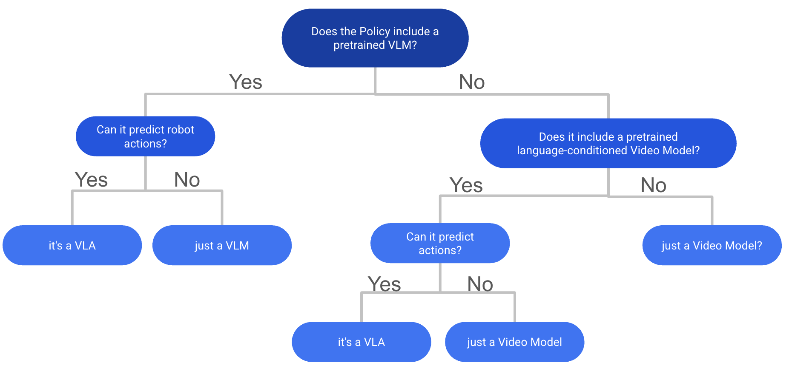

## 概念定义

### What is a Vision-Language-Action Model?

VLM并不一定包含预训练的VLM, 满足VLA定义的关键在于：

1. 能接受language + video输入
2. 能够预测actions

但忽略了一点：

是否进行了**基于视觉-语言数据**的**互联网规模预训练**

如果没有internet-scale train, 作者认为属于 multimodel policies， 例如一个模型中使用了独立的文本encoder（如CLIP-text或T5）和视觉encoder（DINOv2/v3，SigLIP-Vision）,这种应该被归类为多模态

### Large Behaviour Model

丰田 2025.7 [A Careful Examination of Large Behavior Models for Multitask Dexterous Manipulation](https://toyotaresearchinstitute.github.io/lbm1/)

LBM认为所有使用 机器人演示数据来训练的模型都是LBM, 但是其不要求大规模数据（Internet-scale）

现有的VLA都是LBM, 

### VLA sim benchmark

|Name|Link|time|类型|现状|
|-|-|-|-|-|
|LIBERO|LIBERO: Benchmarking Knowledge Transfer for Lifelong Robot Learning|2023.7|语言驱动机器人操作 |基本被解决，98%和99%区别不大，且不一定要VLA策略才能拿到高指标。在Spatial, Goal和Object上至少95%以上|
|SIMPLER|Evaluating Real-World Robot Manipulation Policies in Simulation|2024.5||
|CALVIN|CALVIN: A Benchmark for Language-Conditioned Policy Learning for Long-Horizon Robot Manipulation Tasks|2022.7||

真实场景的实验非常重要，尤其是对于有7B参数量的模型，这种规模的模型非常擅长在sim benchmark上过拟合。

#### 常用指标

成功率 （success rate）
任务完成百分比（task completion percentage）
任务完成耗时（completion time）
泛化能力（generalization， 对没见过的物体，任务和场景的效果）
采样效率（sample efficiency）

#### LIBERO

还有：所有任务的 人类遥操示范数据（50条/任务） 用于模仿学习

| Task Suite         | 关注知识类型    | 任务数量 | 特点           |
| ------------------ | --------- | ---- | ------------ |
| **LIBERO-SPATIAL** | 空间关系（陈述性） | 10   | 同物体不同空间布局    |
| **LIBERO-OBJECT**  | 物体类别（陈述性） | 10   | 不同物体、相同场景    |
| **LIBERO-GOAL**    | 动作目标（程序性） | 10   | 相同物体与布局，不同目标 |
| **LIBERO-100**     | 混合知识      | 100  | 多样化物体、目标与场景  |

setting

#### CALVIN

|setting|train on| test on |-|
|--|--|--|--|
|D|D|D||
|ABC|ABC|D|测试对unseen setting的泛化能力|
|ABCD|ABCD|D|测试使用更多样的数据进行fine-tune的收益|

### Gap on Zero-shot Task

零样本泛化能力，这一点在sim benchmark上反应不出来。即，两个VLA policy可能在sim benchmark上得分相近，但其zero-shot能力（real-world performance）可能差异巨大。

现有的开源方案相比于闭源方案在**零样本任务**上依然有很大差异，例如**Gemini-Robotics** and **Pi0.5**

为什么会存在这一差异？

1. benchmark饱和：在数据集上提升0.5%并不能代表真正的提升
2. 高质量数据不足：现有的开源数据集在规模和多样性上不足
3. 什么样的数据算**高质量数据**？缺乏标准。
4. 评估范围窄：大多数论文只在少量benchmark上（LIBERO, CALVIN），只报告纯仿真（sim-only， 无真机实验）和 本地微调（locally finetuned）的结果（评估环境和训练环境非常接近）。这样的结果无法反映模型对于 未见过的任务 和 在真实世界中的能力
5. 缺乏足够的人力/时间在真实环境中测试，大多数模型还是在仿真环境中训练和测试。
6. 评价标准：审稿人倾向于看到与其他baseline的比较，因此倾向于在仿真环境中测试。

### 离散扩散VLA (Discrete Diffusion VLA)

Why discrete diffusion VLA？ 相比于自回归模型的不同？

1. 能够并行生成token，对于action token生成来说非常重要，可以在几次forward后得到长动作序列，而非将一个模型运行100次

2. 与ECoT（下一节）结合，可以并行生成子目标和共同推理。 

DISCRETE DIFFUSION VLA: BRINGING DISCRETE DIFFUSION TO ACTION DECODING IN VISION-LANGUAGE-ACTION POLICIES
TL;DR: Take OpenVLA and apply Discrete Diffusion Action Prediction for fast action chunk-based generation of discrete action tokens. Also proposes adaptive decoding for inference. Strong results on LIBERO + SIMPLER.

dVLA: DIFFUSION VISION-LANGUAGE-ACTION MODEL WITH MULTIMODAL CHAIN-OF-THOUGHT
TL;DR: Another Discrete Diffusion VLA using Co-Generation for Future Frames and text + actions given the advantage of fast parallel sampling of Discrete Diffusion over AR models. Basically ECoT + Discrete Diffusion done well. Also good results in LIBERO + real world experiments.

DIVA: DISCRETE DIFFUSION VISION-LANGUAGE-ACTION MODELS FOR PARALLELIZED ACTION GENERATION
TL;DR: Another discrete Diffusion VLA that also focuses on how to substitute tokens during inference for better performance.

UNIFIED DIFFUSION VLA: VISION-LANGUAGE-ACTION MODEL VIA JOINT DISCRETE DENOISING DIFFUSION PROCESS
TL;DR: Generates future frames and discrete actions together with block-wise causal masking. Results on CALVIN, LIBERO and SIMPLER are good.

**openpi虽然论文中提到了diffusion policy，但是并不是diffusion结构的。属于自回归。**

### 推理VLA（Reasoning VLA）和具身思维链 (Embodied Chain of Thought, ECoT)

将LLM中的CoT（Chain-of-Thought）引入VLA, 提升泛化和对复杂任务的处理能力。使用中间的视觉和文本推理，帮助VLA理解环境。更具有可解释性，并且能够帮助debug和理解VLA的推理过程。

概念解释：

Chain-of-Thought Reasoning：模型不仅接受输入输出，还要**显式地**暴露中间的推理步骤（Reasoning traces）。

the first ECoT paper (CoRL 2024, Robotic Control via Embodied Chain-of-Thought Reasoning)

引入到具身智能之后，ECoT（Embodied CoT），主要在3个层面：

1. Vision Reasoning, 观察图像-识别目标-物体间关系
2. Text Reasoning, 输入命令-拆分-生成任务计划
3. 将视觉和语言推理转化为动作action, 移动-抓-旋转-归位

关键在于为什么需要显式？显式比隐式更优？

**可解释性**（Interpretability） & debug：对于操作任务，能够定位错误发生的阶段
**泛化性**（Generalization）：有助于迁移到新任务。例如抓不同的货物，只是将实体替换了，后续的行为是类似的。
**因果一致性**（Causal Grounding）：感知-推理-行动 三个层面的一致。

1. 视觉层面：物体和动作的因果关系。
2. 语言层面：理解语言指令
3. 动作层面：动作与推理一致

相比于端到端只监督loss（结果成功or not），对因果链的学习更能实现长期规划和多阶段任务。

limitation: 

1. token数增加
2. VLA自身的自回归特性，训练和推理速度慢
3. 对像DROID这种大规模数据进行标注非常困难

Training Strategies for Efficient Embodied Reasoning：该文对CoT进行了研究，CoT Reasoning能够弥补VLM静态预训练与机器人任务之间的差异。

### New Tokenizer

VLM和action token**表示的不对齐**。控制机器人时使用的命令是**高频且连续**的（如关节角度，夹爪状态），但VLM的预训练输出的token大多是离散的，并且遗忘（forgetting）会严重影响action生成。

Tokenizer的核心思想是将**连续动作序列**转换成**VLM可以预测的离散token**。

Tokenizer的目标是满足以下几点：
1. 快
2. 长动作块（long action chunks）的高压缩比
3. 产生平滑的长期输出（long horizon output）
4. 无需修改现有的VLM结构

之前的工作使用 离散箱（discrete binning， RT-1 中使用），VQ-VAE codebook, 但是这两种方案精度不够高，长序列效率低。FAST使用了action-chunk tokenizer，证明离散token能够替代更复杂的扩散/流 专家模型。基于此，一些新的Tokenizer

1.（如：SoundStream）将残差矢量量化（RVQ，Residual Vector Quantization）的工作实现了更高的压缩，
2. FAST，收到BEAST启发（基于样条的参数化）实现平滑，长距离，DCT-style objectives。其输出偏向 低频，物理上合理的动作。

FASTER: TOWARD POWERFUL AND EFFICIENT AUTOREGRESSIVE VISION–LANGUAGE–ACTION MODELS WITH LEARNABLE ACTION TOKENIZER AND BLOCK-WISE DECODING
TL;DR: Introduces a novel discrete action tokenizer called FASTer, that combines Residual Vector Quantification (RVQ) with a frequency L1 loss using DCT and time domain L1 loss for improved performance. Also patchifies action tokens along the temporal axis and grouped action dimension axis (e.g. base motion, arm joints). It has a higher compression ratio than FAST and results on SIMPLER and LIBERO are strong.

OMNISAT: COMPACT ACTION TOKEN, FASTER AUTOREGRESSION FOR VISION-LANGUAGE-ACTION MODELS
TL;DR: Another tokenizer for VLAs that uses our BEAST paper idea of B-Splines for compact representation of continuous action chunks. It uses a two stage encoding process: First, aligning the different action chunk lengths of different embodiments into a normalized, fixed-length representation. Next, it uses a B-Spline based encoder to get a compact representation of the normalized action chunk. Finally, a VQ-VAE is used to get discrete tokens. Results on LIBERO and SIMPLER are good and across all benchmarks improves upon both FAST and BEAST.

### RL for VLA

依然没有统一的微调方法能够将VLA的成功率从70~80%提高到99%

SELF-IMPROVING VISION-LANGUAGE-ACTION MODELS WITH DATA GENERATION VIA RESIDUAL RL
TL;DR: Residual RL method that collects more data with frozen VLA and small residual policy. The residual interventions are used to get more high quality data with recovery behavior. Finally the VLA is finetuned using SFT. Results on LIBERO achieve 99%.

PROGRESSIVE STAGE-AWARE REINFORCEMENT FOR FINE-TUNING VISION-LANGUAGE-ACTION MODELS
TL;DR: The method breaks robot tasks into semantic stages (Reach→Grasp→Transport→Place) and assigns rewards to each stage instead of the whole trajectory. It uses STA-TPO for offline preference learning and STA-PPO for online reinforcement learning, both operating at the stage level. Results on Bridge SIMPLER of 98%.

### VLA + Video Prediction

使用视频生成模型来学习关于运动和物理的表示

从GR-1开始，策略分成了两种：
1. 使用包含可选image/video generation的VLM
2. 使用Video Foundation Model

limitation:

1. 慢
2. 对视频生成模型的微调成本高

但其包含的 物理理解 和 语言基础 对VLA是有价值的先验。

### Benchmark

VLA benchmark的数量相当饱和，大多数论文只与少量的几个baseline比较，因此很难说哪个模型更好

有些论文尝试引入新的VLA benchmark来弥补这一gap
另一些使用real2sim 在世界模型生成的环境中进行test（即，训练好之后，生成一个test scene&task 来测试）

但这个方向还不够成熟

什么样的数据集算高质量数据集？兼顾规模与广度，涵盖尽可能多的任务和设置。

## sim数据集

### LIBERO

研究目标：
1. 不同类型知识的转移能力：要完成一个任务：将A放到B处
VLA模型需要能够：
> 识别A
> 了解动作：放
> 识别位置B
因此，需要确定对不同类型知识的转移能力，来确定是什么导致的失败。

1,2,3 测试对空间，物体，任务目标的知识转移能力
4测试对混合知识类型的转移能力

2. 模型的结构

如何将多模态观测数据进行抽象（表示方式）并仅转移相关知识

3. 学习方法。轻微的遗忘也会导致失败

4. 任务顺序的鲁棒性

5. 预训练模型发挥了多大用处

## real数据集

### BridgeData V2（2023）

包含多种Robo Setting, openVLA使用WidowX robot

### Google robot evaluation

### DROID

### Open X-Embodiment (OXE)

## 方法

RT-1-X
Octo
RT-2-X
OpenVLA

FAST

**ICLR**
FAST
BEAST

## 训练策略

|Name|train on|deploy on|comment|例子|
|-|-|-|-|-|
|sim2real|sim|real|感知domain gap||
|real2sim|sim||描述的是数据的构建方式，让仿真环境与真实接近。| OpenVLA中的RLBench，接近来自Bridge V2的真实数据|
|real2sim2real||||
|sim2real2sim|||||

### sim2real

### real2sim

## Q

place - observation - operation

能否实现基于现有的模型，随机/自由摆放，生成数据训练

## 综述: 

仓库链接：
https://github.com/BaiShuanghao/Awesome-Robotics-Manipulation

