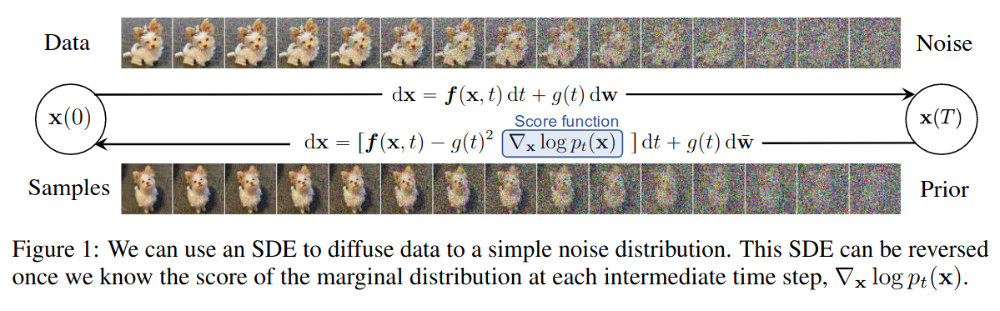
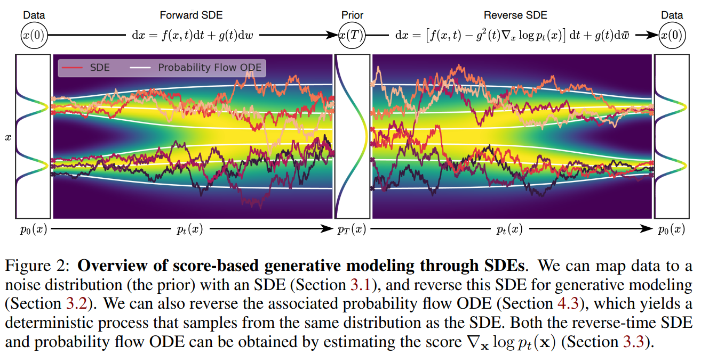

参考：

Maximum Likelihood Training of Score-Based Diffusion Models(NeurIPS 2021)

Flow Matching for Generative Modeling

## 基础概念

**概率路径(probabilty path)**: 一个随着时间$t\in[0, 1]$变化的概率分布簇$\{p_t(x)\}$

**连续正则化流(Continuous Normalizing Flow)**: CNF是一种生成模型，它的核心思想是通过一个**连续时间**的**可逆**变换（flow），把一个简单的分布（如高斯噪声）平滑地“流动”成一个复杂的目标分布（如自然图像）。

<figure class="figure-center">
  
  <figcaption>Maximum Likelihood Training of Score-Based Diffusion Models(NeurIPS 2021)</figcaption>
</figure>

<figure class="figure-center">
  
  <figcaption>SCORE-BASED GENERATIVE MODELING THROUGH
STOCHASTIC DIFFERENTIAL EQUATIONS</figcaption>
</figure>

上图为扩散模型的工作原理，上半部分的forward过程（加噪）中，原始数据被添加布朗运动（随机噪声）$\text{d}w$，直至变为高斯噪声。

网络学习的就是下半部分的反向过程：从噪声一步步去噪回原图（反向扩散）。因此，扩散模型本质上是在学习一个“随机微分方程 (SDE)”的逆过程

---

那么这个扩散过程有什么问题？

慢
训练时：需要在多个时间步上加噪、去噪，通常要训练上百万步。
推理时：生成一张图像要反向积分数百到上千步（如 DDPM 要 1000 步）。
不同随机噪声导致梯度估计方差大，收敛更慢。训练需要平均大量样本才能稳定

因此，CNF的目的就是为了排除掉随机性。数学推导可以证明（见 Song et al., 2021），这里说结论：
~~~
对于每一个扩散 SDE，
都存在一个确定性的 ODE（称为 Probability Flow ODE）
它生成的分布族 与 SDE 完全相同。
~~~

也就是说：
~~~
Diffusion (随机) ↔ CNF (确定性)
~~~

两者在“概率意义上等价”，只是生成路径不同：

flow matching的公式与对应实现可参考：https://colab.research.google.com/github/gle-bellier/flow-matching/blob/main/Flow_Matching.ipynb

---

**Flow Matching**

虽然 CNF 很优雅，但一切并非没有代价，**原始CNF的训练需要对ODE进行复杂的数值积分（极慢）**
《Flow Matching for Generative Modeling》提出：用 Flow Matching (FM) 的思想来训练 CNF，即直接让神经网络回归一个目标向量场 从而不需要模拟 ODE 也能训练 CNF

这就把 CNF 变成了：
无需仿真（simulation-free）
高效可扩展
可以使用任意类型的概率路径（不再局限于扩散那种）

### 概念：向量场，流

$$
p: [0,1] \times \R^d\rightarrow \R_{>0}
$$

p是一个映射函数$p(x, t)$

输入:时间$t$（0到1之间）和空间点$x$（d维）
输出：空间点$x$在$t$时刻的概率密度值（正实数）

向量场（vector field）描述了点的运动规律，在$t$时刻点$x$的瞬时速度（一个方向）：
$$v_t(x) = \R^d\rightarrow\R^d$$

对于任何一个初始点$x$，其轨迹满足微分方程：

$$
\frac{d}{dt}x(t) = v_t(x(t))
$$

初始条件为：

$$
x(0) = x_0
$$

通过积分就能够得到$t$时刻初始点$x_0$的位置$x(t)$

在实践中，我们不仅关注单个点的变化，而是关注所有的样本的分布的变化，**空间中的所有点$x$是如何随着时间变化的**，前面我们用公式：

$$
\frac{d}{dt}x(t) = v_t(x(t))
$$

可以描述单个点是如何随着时间变化的，那么到了分布中，我们需要引入额外的概念：流

流（flow）是一个映射函数，$\phi_t(x)$表示$t$时刻空间中所有点位置。

$$
\phi_t(x): \R^d \rightarrow \R^d
$$

---

可以说：**flow是由vector field生成的（generated），二者的关系由以下常微分方程定义：**

$$
\frac{d}{dt}\phi_t(x) = v_t(\phi_t(x))
$$

初始条件为（0时刻x在原地不动，flow是恒等函数）：

$$
\phi_0(x) = x
$$

### CNF

因此就有人提出使用神经网络来学习vector field, $v_t(x;\theta)$，其中$\theta$是可学习的参数，即代表深度学习得到的model

$p_t(x)$是一个概率密度函数，与$\phi_t(x)$是一个确定性函数不同，$p_t(x)$的作用就是描述分布，表示样本在空间中的“分布”，不同于$\phi_t(x)$表示的“确定性的位置”。

因为在运动的过程中，vector field可能会压缩/拉伸初始分布，导致即便知道样本在$t$时刻的位置，其分布变化可能很大。

---

因此，需要一个公式将概率密度分布与已有的flow结合起来，实现：

$$
x_0 \sim p_0, x_1 \sim p_1
$$

现在已经有了公式可以计算点的位置变化：

$$
x_1 = \phi_1(x_0)
$$

需要一个公式$f_t(x)$来实现：

$$
p_1 = f_1(p_0)
$$

---

**flow matching**文中的公式3和4就是来实现这个$f_t(x)$的：

$$
p_t = [\phi_t]_* p_0
$$

$$
[\phi_t]_* p_0(x) = p_0(\phi_t^{-1}(x))
\det\!\left( \frac{\partial \phi_t^{-1}(x)}{\partial x} \right)
$$

其中定义了一个**push-forward operator**，也叫**变量代换（change of variables）**。其推导来自：概率守恒+ 变量代换公式

对于一个样本$A$，初始时刻和$t$时刻在空间中所有点的概率和应该是不变的。

$$
\forall A \subseteq \mathbb{R}^d, \quad
\int_A p_t(x)\,dx = 
\int_{\phi_t^{-1}(A)} p_0(x)\,dx
$$

> 当$A=\R^d$时, $\quad
\int_A p_t(x)\,dx = 
\int_{\phi_t^{-1}(A)} p_0(x)\,dx = 1$

应用变量代换，将右边的$\phi_t^{-1}(A)$替换为$A$

$x = \phi_t(x_0)$ 的反函数满足 $x_0 = \phi_t^{-1}(x)$

1维情况下，微元部分的变化为：

$$
dx_0 = d\phi_t^{-1}(x) = \left|\frac{d\phi_t^{-1}(x)}{dx}\right|dx
$$

$\left|\frac{d\phi_t^{-1}(x)}{dx}\right|$是jacobian修正项，用于修正积分比例。（因为替换后，相当于坐标轴的尺寸发生了变化，乘以一个比例系数才能正确计算）

到多维情况下， jacobian修正项从一个值变成了行列式：

$$
dx_0 = 
\left|
\det\!\left(
    \frac{\partial \phi_t^{-1}(x)}{\partial x}
  \right)
\right| dx
$$

$$
\int_{\phi_t^{-1}(A)} p_0(x)\,dx
= \int_A p_0(\phi_t^{-1}(x))
\left|
  \det\!\left(
    \frac{\partial \phi_t^{-1}(x)}{\partial x}
  \right)
\right| dx
$$

现在融合了概率密度守恒和变量代换，去掉积分部分：

$$
p_0(x) = 
p_0(\phi_t^{-1}(x))
\left|
  \det\!\left(
    \frac{\partial \phi_t^{-1}(x)}{\partial x}
  \right)
\right|
$$

可以发现在最终的结论中，jacobian项的绝对值号没了，因为$\phi_t(x)$始终满足smooth, invertible，因此其jacobian行列式在整个空间上不会改变方向，绝对值号可以去掉
> 本身这个绝对值号就是为了避免出现负号而引入的，因为体积等概念不应该出现负

$$
[\phi_t]_* p_0(x) = p_0(\phi_t^{-1}(x))
\det\!\left( \frac{\partial \phi_t^{-1}(x)}{\partial x} \right)
$$

---

前面提到了flow是由vector field generated，p_t(x)则是由flow进一步生成的。$p_t$被称为概率密度路径(**probability density path**)

> A vector field $v_t$ is said to generate a probability density path $p_t$ if its flow $\phi_t$ satisfies equation: $p_t = [\phi_t]_* p_0$

**v_t(x)定义了位置的移动（ODE），p_t满足连续性方程（PDE）**

---

density path $p$

在初始时, prior density path $p_0$是一个纯噪声，基于该prior,CNF的

% --- Change of variables formula ---
\begin{equation}

\label{eq:change_of_variables_integral}
\end{equation}

% --- Equating integrands (probability conservation holds for all regions A) ---
\begin{equation}
p_t(x)
= p_0(\phi_t^{-1}(x))
\left|
  \det\!\left(
    \frac{\partial \phi_t^{-1}(x)}{\partial x}
  \right)
\right|
\label{eq:pushforward_density}
\end{equation}

% --- Simplified form: definition of push-forward operator (Equation 4) ---
\begin{equation}
[\phi_t]_* p_0(x)
= p_0(\phi_t^{-1}(x))
\det\!\left(
  \frac{\partial \phi_t^{-1}(x)}{\partial x}
\right)
\label{eq:pushforward_def}
\end{equation}

## Gaussian probability path