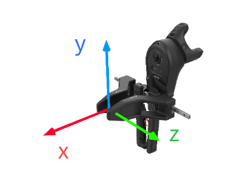
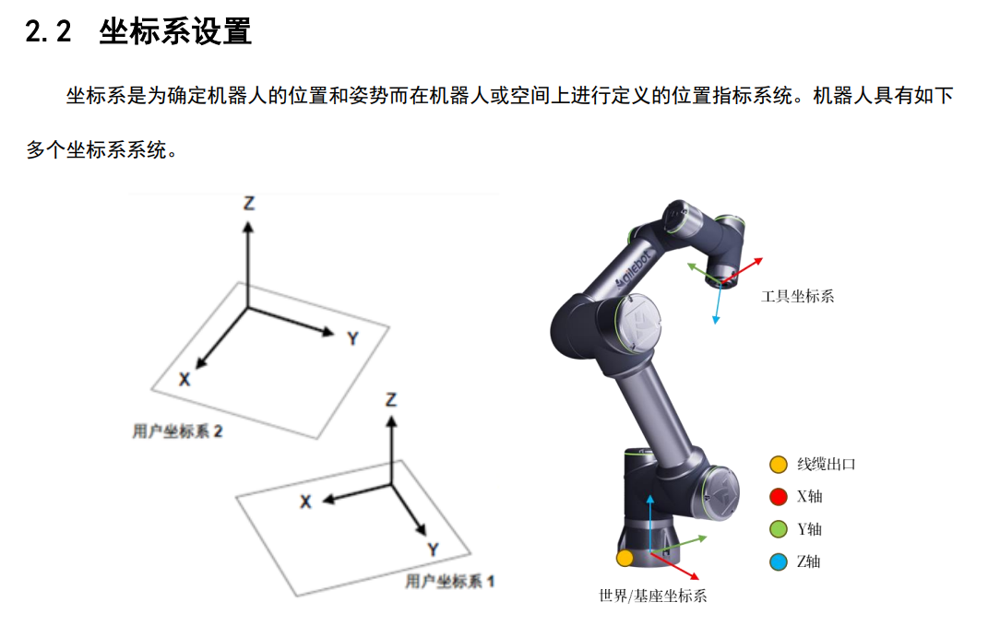

目标：标定pika与机械臂末端架爪坐标系

因为架爪与机械臂末端之间的定制连接件的孔位不是严格对齐的，因此使用六点标定（偏移和旋转量），架爪TCP到末端的变换矩阵。

## 坐标系

<figure class="figure-center">
  
  <figcaption>pika坐标系: pika的坐标系是在夹爪中心上，x轴朝前、y轴朝左、z轴朝右。</figcaption>
</figure>

<figure class="figure-center">
  
  <figcaption>Agilebot坐标系</figcaption>
</figure>

*工具坐标系：这是用来定义工具中心点（TCP）的位置和工具姿势的坐标系。工具坐标系必须事先进行设定。未定义时，默认是末端法兰坐标系。*

## 需要确定

pika sense坐标系的中心点位置。

标定针标定后的结果是针尖，因此需要测量后减去。

## 参考

[工业机器人工具坐标系（TCF）标定的六点法原理](https://www.cnblogs.com/beta-1999/p/13121564.html#mtop)

在工具上确定的一个参考点（最好是工具中心点Tool Center Point, TCP），作为机器人动作范围内的参考点。

[pika](https://agilexsupport.yuque.com/staff-hso6mo/peoot3/sg37llutwfhu77du)