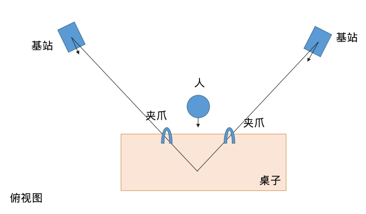

## 

## 数据采集

### 硬件

1. 基站亮绿灯

2. 确保顶部HTC vive的传感器已经启动（亮绿灯）

### 程序

3. 标定（清空之前的结果，否则去掉--force-calibrate）
~~~bash
cd ~/workspace/pika_ros/install/libsurvive/bin && ./survive-cli --force-calibrate
~~~

4. 启动sensor

~~~bash
cd ~/workspace/pika_ros/scripts
bash start_multi_sensor.bash 
~~~

start_multi_sensor.bash中可以修改相机帧率（参考realsense-viewer中已有的帧率配置）

5. 启动记录程序

~~~
ros2 launch data_tools run_data_capture.launch.py useService:=true type:=multi_pika datasetDir:=$HOME/agilex/data episodeIndex:=0
~~~

episodeIndex:=0为从0开始记录，如果有已有数据建议清空或修改该编号

6. 数据对齐和处理（pika）
~~~
conda activate pika && cd ~/workspace/pika_ros/scripts && python3 data_sync.py --type multi_pika --datasetDir $HOME/agilex/data/  # 双夹持器
~~~
同步后，每个相机的路径下会有一个sync.txt文件

生成点云（可选）
~~~
conda activate pika && cd ~/workspace/pika_ros/scripts && python3 camera_point_cloud_filter.py --type multi_pika --datasetDir $HOME/agilex/data/  # 双夹持器
~~~

转换hdf5
~~~
conda activate pika && cd ~/workspace/pika_ros/scripts && python3 data_to_hdf5.py --type multi_pika --datasetDir $HOME/agilex/data/  # 双夹持器
~~~

7.转换数据为lerobot格式

两种方案: 

手动处理数据
~~~
PIKA_DATA=/home/xxx/agilex/data
cd /home/xxx/workspace/VLA/openpi
source .venv/bin/activate
python examples/libero/pika_cut_gradio.py
~~~

不处理数据直接转换
~~~
PIKA_DATA=/home/xxx/agilex/data
cd /home/xxx/workspace/VLA/openpi
source .venv/bin/activate
cd /home/xxx/workspace/VLA/openpi/examples/libero && python convert_pika_data_to_lerobot.py --data_dir $PIKA_DATA
~~~

### 服务器

上传lerobot数据到服务器

修改repo
~~~
vim /app/.venv/lib/python3.11/site-packages/openpi/training/config.py
~~~

计算norm_stat
~~~
python scripts/compute_norm_stats.py --config-name pi05_pika
~~~

训练
~~~
XLA_PYTHON_CLIENT_MEM_FRACTION=0.9 python scripts/train.py pi05_pika --exp-name=cillion_test --overwrite
~~~

## 关于数据方案

umi数据与遥操数据，

umi数据的好处是采集灵活，效率高。但是其缺乏了机械臂的内部参数，如关节角度，关节速度等只能依靠来获得

## 数据转换

openpi的示例libero数据转换使用的是来自OpenVLA附录中提到的处理后的4个数据集，他们是OpenVLA按照[rlds的格式](https://github.com/google-research/rlds)处理过的。

观察OpenVLA的相关处理:experiments/robot/libero/regenerate_libero_dataset.py、experiments/robot/libero/run_libero_eval.py、prismatic/vla/datasets/rlds/oxe/transforms.py 和 configs.py）

<figure class="figure-center">
  
  <figcaption>pika坐标系: pika的坐标系是在夹爪中心上，x轴朝前、y轴朝左、z轴朝上。</figcaption>
</figure>

### state 的维度：8
前 6 维：EEF_state（3 维位置 + 3 维 orientation 的 axis-angle / Euler 表示，共 6 维）。代码中有 obs["robot0_eef_pos"] 和 quat2axisangle(obs["robot0_eef_quat"]) 拼接成 6 维 ee_states。
最后 2 维：gripper_state（robot0_gripper_qpos，为 2 维 gripper qpos）。
证据：regenerate_libero_dataset.py 将 ee_states 保存为 6 维，并在 transforms.py 中把 trajectory["observation"]["EEF_state"] = state[:, :6] 且 gripper_state = state[:, -2:]（注释为 “2D gripper state”）。

### action 的维度：7
前 6 维：与末端执行器（EEF）相关的运动维度（EEF_pos + EEF_orientation），通常以 3D 位置 + 3D 方向表示（仓库中用 position(3) + quat→axis-angle(3) 表示）。
第 7 维（最后一维）：夹爪动作（gripper），标量（表示开/关，仓库中有多个位置对其进行归一化/翻转以匹配不同表示，例如在 transforms.py 中把 gripper clip 到 0..1 并翻转，环境期望的是 -1..+1）。
证据：get_libero_dummy_action 返回长度 7 的动作向量；transforms.py 把 action[:, :6] 与 gripper(action[:, -1:]) 分开处理并重新 concat。

#### pika数据转换

<figure class="figure-center">
  
  <figcaption>pika坐标系: pika的坐标系是在夹爪中心上，x轴朝前、y轴朝左、z轴朝上。</figcaption>
</figure>

如图所示，x轴朝前，y轴朝左，z轴朝上

~~~
x, y, z, roll, pitch, yaw
~~~

roll, pitch, yaw对应x,y,z的旋转

常见组合 ZYX:

外旋ZYX或者内旋XYZ，哪种都能解释，最终结果是一样的

#### rot

$$
T_{\text{base}}^{-1} T_{\text{end}}
= \begin{bmatrix}
R_{\text{base}} & t_{\text{base}} \\
0 & 1
\end{bmatrix}^{-1}
\begin{bmatrix}
R_{\text{end}} & t_{\text{end}} \\
0 & 1
\end{bmatrix}
$$

$$
T_{\text{base}}^{-1} T_{\text{end}}
= \left[ R_{\text{base}}^{\top}, - R_{\text{base}}^{\top} t_{\text{base}} \right] \left[ R_{\text{end}}, t_{\text{end}}
\right]
= \left[
R_{\text{base}}^{\top} R_{\text{end}},\;
R_{\text{base}}^{\top} (t_{\text{end}} - t_{\text{base}})
\right].
$$

### 初步方案

state: [pos, rot, gripper_angle]

action: [$\Delta$pos, $\Delta$rot, $\Delta$gripper_angle]

state是输入给模型的观测，包括当前的相机观测，姿态等

action则是模型的预测gt，当前状态对应的未来n步动作，如delta末端姿态/delta关节角度/夹爪数值

虽然是这样,　但是在数据转换阶段, add_frame中只能存一时刻的state和action, 此时他们又分别是什么？

## 更远的事情

聊点其他的更遥远的事情。鱼眼相机虽然能够获得更多的视野（论文中有对比普通相机与鱼眼相机的效果），
但是其观察的视角与人类（操作者）的视角并不相同。

例如在操作插板子时（类似于插内存条的动作）负责插的夹爪的鱼眼相机观测视角是不够的，此时即便是人类也需要尝试不同的视角来观察。

虽然可以说，人类的的观察视角并不一定是最优的，但是就目前的进度而言，既然需要依赖人类操作者来采集数据，那么一个符合人类视角的观测是否是更为合理呢？
又或者，我们是否有方式可以直接越过这个阶段。

人类视角观察&人类视角操作 -> 人类视角观察&机器视角操作　-> 机器视角观察&机器视角操作

## 参考

https://github.com/Physical-Intelligence/openpi/issues/454

https://github.com/real-stanford/universal_manipulation_interface/issues/90

https://github.com/Physical-Intelligence/openpi/issues/637

https://umi-gripper.github.io/

https://umi-on-legs.github.io/

https://github.com/huggingface/lerobot/blob/6e86a69dcd049f76436a73b759ccacd94bc06a63/docs/source/lerobot-dataset-v3.mdx#L298

升级openpi的lerobot版本
https://github.com/Physical-Intelligence/openpi/issues/689#issuecomment-3475459732
https://github.com/Physical-Intelligence/openpi/issues/595#issuecomment-3240702737

---

可以看看

https://github.com/X-Square-Robot/wall-x/issues/26 wall-x使用绝对位姿输入模型

## 其他

### 部分步骤的正常输出

用于对比

~~~
~/workspace/pika_ros/install/libsurvive/bin$ ./survive-cli --force-calibrate
Info: Loaded drivers: GlobalSceneSolver, HTCVive
Info: Force calibrate flag set -- clearing position on all lighthouses
Info: Adding tracked object WM0 from HTC
Info: Device WM0 has watchman FW version 1592875850 and FPGA version 538/7/2; named '                       watchman'. Hardware id 0x84020109 Board rev: 3 (len 56)
Info: Detected LH gen 2 system.
Info: LightcapMode (WM0) 1 -> 2 (ff)
Info: Adding lighthouse ch 6 (idx: 0, cnt: 1)
Info: OOTX not set for LH in channel 6; attaching ootx decoder using device WM0
Info: Adding lighthouse ch 1 (idx: 1, cnt: 2)
Info: OOTX not set for LH in channel 1; attaching ootx decoder using device WM0
Info: Adding tracked object WM1 from HTC
Info: Device WM1 has watchman FW version 1592875850 and FPGA version 538/7/2; named '                       watchman'. Hardware id 0x84020109 Board rev: 3 (len 56)
Info: LightcapMode (WM1) 1 -> 2 (ff)
Info: (6) Preamble found
Info: (1) Preamble found
Info: (6) Preamble found
Info: (1) Preamble found
Info: Got OOTX packet 6 06448fa4
Info: (1) Preamble found
Info: (1) Preamble found
Info: Got OOTX packet 1 12b2fa8d
Info: MPFIT success 2277272.183140/277.8561557031/0.0001491 (109 measurements, 4, MP_OK_DIR, 6 iters, up err 0.0008807, trace 0.0000188)
Info: Global solve with 3 scenes for 0 with error of 2277272.183140/277.8561557031 (acc err 0.0022)
Info: Global solve with 3 scenes for 1 with error of 2277272.183140/277.8561557031 (acc err 0.0001)
Info: Using LH 0 (06448fa4) as reference lighthouse
Info: MPFIT success 1659.855593/328.8134504763/0.0001460 (139 measurements, 1, MP_OK_CHI, 5 iters, up err 0.0007819, trace 0.0000318)
Info: Global solve with 4 scenes for 0 with error of 1659.855593/328.8134504763 (acc err 0.0023)
Info: Global solve with 4 scenes for 1 with error of 1659.855593/328.8134504763 (acc err 0.0001)
Info: Using LH 0 (06448fa4) as reference lighthouse
Info: MPFIT success 16759.440809/409.2843220775/0.0001468 (176 measurements, 1, MP_OK_CHI, 4 iters, up err 0.0006609, trace 0.0000272)
Info: Global solve with 5 scenes for 0 with error of 16759.440809/409.2843220775 (acc err 0.0023)
Info: Global solve with 5 scenes for 1 with error of 16759.440809/409.2843220775 (acc err 0.0001)
Info: Using LH 0 (06448fa4) as reference lighthouse
Info: MPFIT success 26845.861457/632.1183096072/0.0001677 (205 measurements, 1, MP_OK_CHI, 4 iters, up err 0.0004904, trace 0.0000340)
Info: Global solve with 6 scenes for 0 with error of 26845.861457/632.1183096072 (acc err 0.0019)
Info: Global solve with 6 scenes for 1 with error of 26845.861457/632.1183096072 (acc err 0.0001)
Info: Using LH 0 (06448fa4) as reference lighthouse
Info: MPFIT success 178658.136475/762.8943362070/0.0001695 (244 measurements, 1, MP_OK_CHI, 5 iters, up err 0.0004588, trace 0.0000348)
Info: Global solve with 7 scenes for 0 with error of 178658.136475/762.8943362070 (acc err 0.0020)
Info: Global solve with 7 scenes for 1 with error of 178658.136475/762.8943362070 (acc err 0.0001)
Info: Using LH 0 (06448fa4) as reference lighthouse

~~~

### 问题

Q：卡在没有Preamble found输出，说明频道1和6度基站没有被找到并添加。应该是无线接收器的问题？

~~~
Info: Adding tracked object WM0 from HTC
Info: Adding tracked object WM1 from HTC
Info: Device WM0 has watchman FW version 1592875850 and FPGA version 538/7/2; named '                       watchman'. Hardware id 0x84020109 Board rev: 3 (len 56)
Info: Device WM1 has watchman FW version 1592875850 and FPGA version 538/7/2; named '                       watchman'. Hardware id 0x84020109 Board rev: 3 (len 56)
Info: Detected LH gen 2 system.
Info: LightcapMode (WM1) 1 -> 2 (ff)
Info: LightcapMode (WM0) 1 -> 2 (ff)
Info: OOTX not set for LH in channel 6; attaching ootx decoder using device WM0
Info: OOTX not set for LH in channel 1; attaching ootx decoder using device WM0
~~~

A：将config.json 文件移除后再次进行校准
~~~
rm ~/.config/libsurvive/config.json 
~~~

Q：如果rviz中丢了一个sensor, 只剩下一个sensor, 先等待一会，如果没有出现，使用setup_device.py重新设置

~~~
# 注意确定是鱼眼镜头（共三个镜头rs-rgb, rs-depth, fisheye）再按s，否则按q
cd ~/workspace/pika_ros/scripts/ && python3 setup_device.py

# 启动
cd ~/workspace/pika_ros/scripts && bash start_multi_sensor.bash 
~~~

~~~
source ~/workspace/pika_ros/install/setup.sh 
~~~

#### 场景搭建

推荐基站距离操作中心约1.2m左右
2米向下俯视约15度

注意基站面朝方向不要有LED屛/玻璃等

采集数据时注意硬盘空间，多次采集之间人为地暂停一会，预留一段时间让计算机保存图像。

以及，如果启动sensor时报错No Space left, 检查

~~~
df -h df -i 
cat /proc/sys/fs/inotify/max_user_watches 
cat /proc/sys/fs/inotify/max_user_instances
# 65536 128
~~~

采集数据时将后台的vscode等关闭

  

## 日志

训练结束后, wandb目录下，找到与ckpt中wandb_id.txt中id为后缀的目录，下载到有网络环境中，使用

~~~
wandb sync <folder_path>
~~~

同步日志

#### 关代理

~~~
unset http_proxy
unset https_proxy
unset all_proxy
unset HTTP_PROXY
unset HTTPS_PROXY
unset ALL_PROXY
~~~

#### 上传数据集

~~~
rclone copy /home/eiir/.cache/huggingface/lerobot/winka9587/pick_cillion_v3 s3:mvrdd/public/VLA/datasets/custom/pick_cillion_v3 --progress   --stats=10s   --transfers=8   --checkers=16
~~~

#### 训练结束

~~~
rclone copy  s3:mvrdd/public/VLA/pretrained_weights/cillion_v2/10000 ./cillion_v2/10000  --progress   --stats=10s   --transfers=8   --checkers=16

rclone copy ./lerobot/pick_cillion_gbt/ s3:mvrdd/public/VLA/datasets/custom/pick_cillion_gbt --progress   --stats=10s   --transfers=8   --checkers=16

~~~

### 夹爪控制

~~~
# 1. setup
~/workspace/pika_ros/scripts$ python setup_device.py 

# 2. 终端1: 启动
~/workspace/pika_ros/scripts$ bash start_multi_gripper.bash 

# 3. 终端2: 监听
ros2 topic echo /gripper_l/data
ros2 topic echo /gripper_r/data
# 如果上电正常，默认enable是false，如果默认enable是true，可能是内部默认值，建议检查供电是否正常。
# header:
#   stamp:
#     sec: 1766560607
#     nanosec: 168049360
#   frame_id: ''
# angle: 0.017
# distance: 0.0006614444311719009
# effort: -329.0
# velocity: 0.0
# enable: false
# set_zero: false
# error: false
# voltage: 23.799999237060547
# driver_temp: 39.0
# motor_temp: 34.0
# bus_current: 0.0
# status: '0x40'

# 4. 终端3: 控制
# 以下以left gripper为例
# 失能，关闭对gripper的控制(失能和使能对时间戳无要求)
ros2 topic pub -r 10 /gripper_l/ctrl data_msgs/msg/Gripper "header:
  stamp: {sec: 1766560595, nanosec: 0}
angle: 0.0
effort: 0.0
velocity: 0.0
enable: false"

# 使能，启动对gripper的控制(失能和使能对时间戳无要求)
ros2 topic pub -r 10 /gripper_l/ctrl data_msgs/msg/Gripper "header:
  stamp: {sec: 1766560595, nanosec: 0}
angle: 0.0
effort: 0.0
velocity: 0.0
enable: true"

# 控制开关命令可以复制使能命令，但是注意时间戳复制topic echo相近的时间戳，不然无法控制
# 控制角度
ros2 topic pub -r 10 /gripper_l/ctrl data_msgs/msg/Gripper "header:
  stamp: {sec: 1766560595, nanosec: 0}
angle: 0.0
effort: 0.0
velocity: 0.0
enable: true"
~~~

#### 服务器训练步骤

~~~
export HF_HOME=/home/jovyan/workspace/.cache/

~~~

uv build之后服务器安装
~~~
uv pip install --no-index dist/openpi-0.1.0-py3-none-any.whl

# 修改为服务器路径
vim /app/.venv/lib/python3.11/site-packages/openpi/training/config.py
vim /app/.venv/lib/python3.11/site-packages/openpi/models/tokenizer.py 

# 归一化
XLA_PYTHON_CLIENT_MEM_FRACTION=0.9 python scripts/compute_norm_stats.py --config-name=pi05_pika

# 启动训练
XLA_PYTHON_CLIENT_MEM_FRACTION=0.9 python scripts/train.py pi05_pika --exp-name=<exp_name> --overwrite --num-train-steps=15000
~~~

#### 修改

尝试整合所有的cache文件到s3
